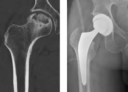
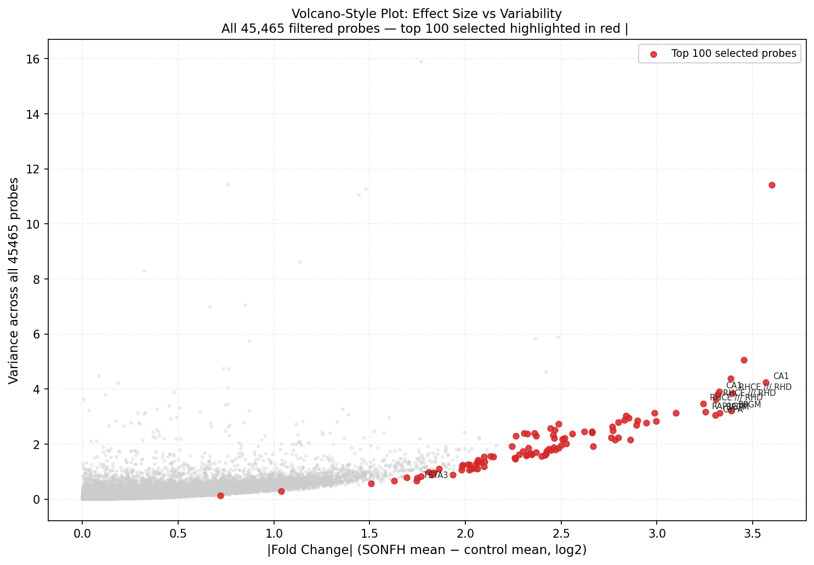
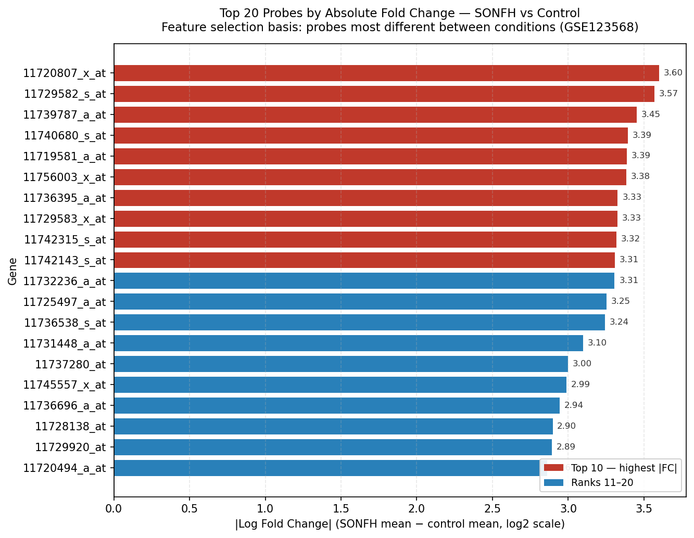
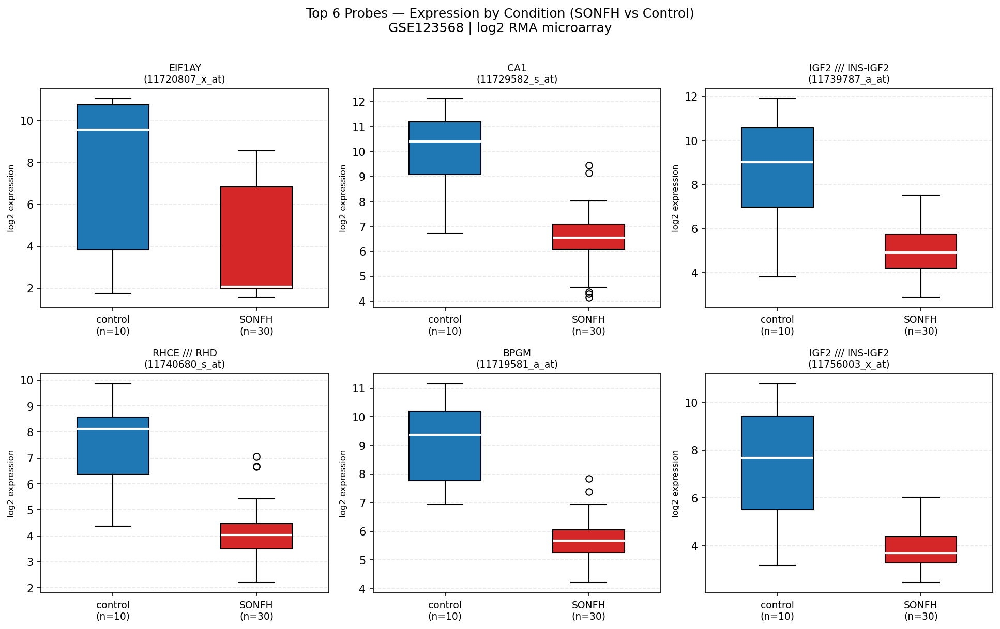
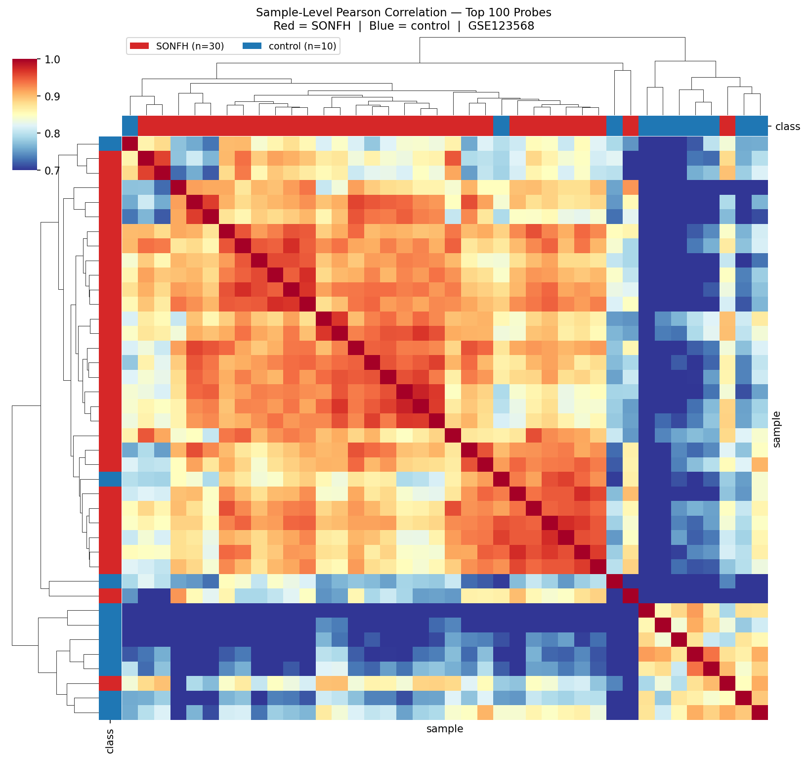
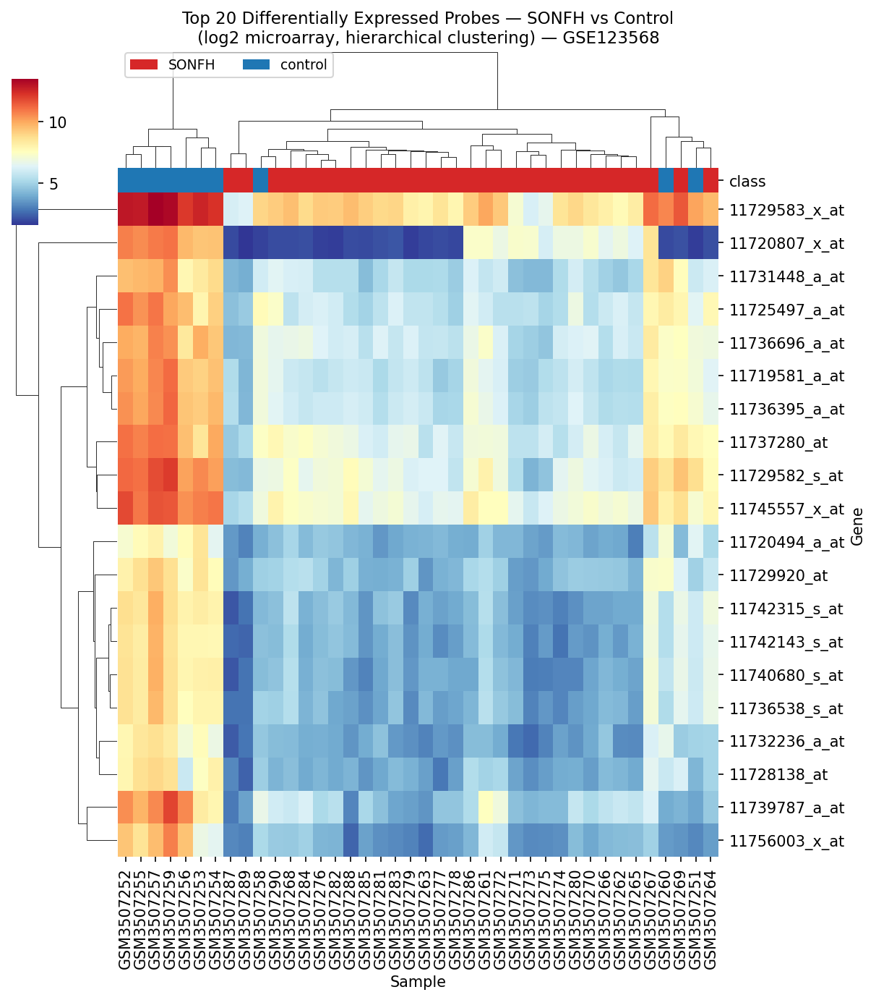
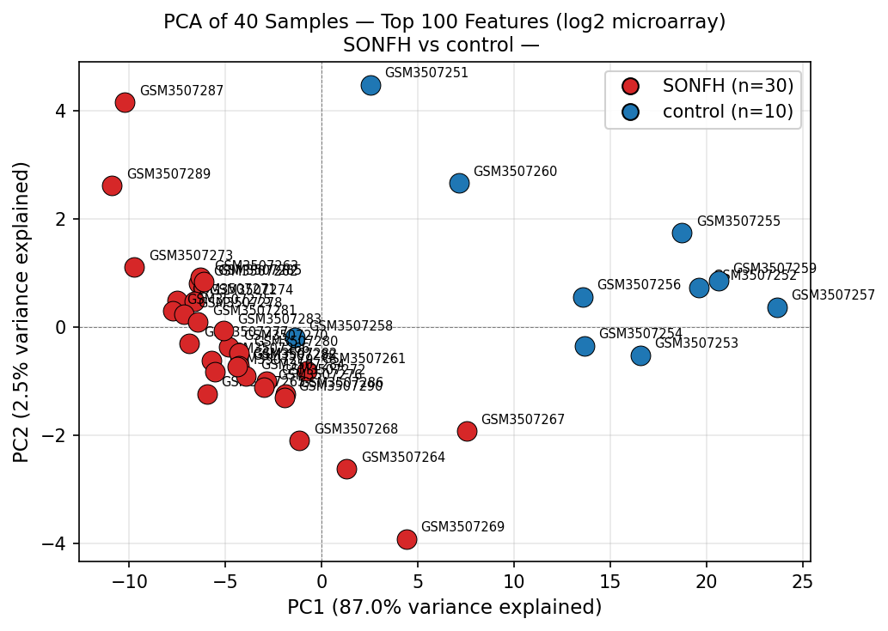

# Capstone: Microarray Analysis with Weka
## Steroid-Induced Osteonecrosis of the Femoral Head — GSE123568
### Extended deadline: April 30 — Target submission: before March 31 (certificate cutoff)

<p align="center">
  
</p>

---

## Before Anything Else

~~- [x] **EMAIL THE PROFESSOR (Mar 6)** — asked whether prostate cancer is mandatory; professor approved femoral head necrosis (GSE316957) as the dataset for this project.~~

**Switched to GSE123568** — 40-sample microarray study, peripheral blood-derived samples, SONFH vs control.
Old scRNA-seq dataset (GSE316957) archived to `data/femoral_head_necrosis_old/`.

---

## Dataset Decision

**Using GSE123568** — Steroid-Induced Osteonecrosis of the Femoral Head (SONFH)

| Field | Value |
|-------|-------|
| GEO Accession | GSE123568 |
| Title | Identification of Potential Biomarkers for Improving the Precision of Early Detection of SONFH |
| Submitter | Yanqiong Zhang — Institute of Chinese Materia Medica, China Academy of Chinese Medical Sciences |
| Submitted | Dec 10, 2018 — Public Dec 31, 2019 |
| Samples | 40 total — **30 SONFH patients, 10 non-SONFH controls** |
| Platform | **GPL15207 — Affymetrix Human PrimeView Array** (see explanation below) |
| Data type | Gene expression microarray — log2 RMA-normalized intensity values |
| Probes | 49,293 probe sets covering the human transcriptome |
| Value range | ~2.6 – 6.7 log2 units (confirmed from file inspection) |
| Sample source | Human peripheral blood-derived samples — non-invasive, clinically accessible |
| Study goal | Blood-based gene expression biomarkers for early SONFH detection |
| Linked paper | Jia Y et al. *Clin Transl Med* 2023;13(6):e1295. PMID: 37313692 |

**What is GPL15207 — Affymetrix Human PrimeView Array?**

A **microarray** is a glass chip printed with thousands of short DNA sequences (called probes),
one for each gene in the human genome. When you wash a blood sample over the chip, each gene's
RNA sticks to its matching probe and glows proportionally to how active that gene is. The
machine reads the brightness and converts it to a number.

- **Affymetrix** — the company that makes the chip (now part of Thermo Fisher)
- **PrimeView** — the specific chip model; covers **~49,000 probe sets** mapping to ~36,000 human genes
- **GPL15207** — GEO's internal ID for this chip design (every array platform gets one)
- **RMA normalization** — a standard algorithm (Robust Multi-Array Average) already applied
  before GEO upload; corrects for background noise and makes samples comparable. Values come
  out in **log2 scale** (e.g. a value of 7 means 2⁷ = 128 relative intensity units)
- **Not DNA sequencing** — microarrays measure known genes only; RNA-seq discovers new ones.
  For biomarker studies, microarrays are faster, cheaper, and clinically validated.

**SONFH — Steroid-induced Osteonecrosis of the Femoral Head**
- **Steroid-induced** — triggered by long-term corticosteroid use (e.g. prednisone, dexamethasone)
- **Osteonecrosis** — bone death caused by disrupted blood supply (also called avascular necrosis)
- **Femoral Head** — the ball at the top of the thigh bone that sits in the hip socket

When blood supply to the femoral head is cut off, the bone dies and eventually collapses,
causing severe hip pain and loss of function. Early detection (before collapse) allows
intervention with core decompression or other joint-preserving procedures.
The controls in this study are steroid users who did *not* develop osteonecrosis —
making the comparison about **disease susceptibility**, not just steroid exposure.

**Why this is better than the old dataset:**
- 40 samples vs 5 — 8× more data, meaningful statistical power
- Already sample-level — no pseudobulk aggregation needed
- Published and peer-reviewed with a linked paper
- Clinically relevant: blood-based early detection (actionable before bone collapse)

**Class imbalance note:** 30 SONFH vs 10 control (3:1 ratio). Mention in Methods
as a study design limitation. Because the classes are imbalanced, results should be reported using per-class metrics (TP rate, F1, confusion matrix, and AUC), not overall accuracy alone.

---

## Getting Started — Data Download

> **Data is not included in this repository.** All raw and processed data files are gitignored.
> Follow these steps before running any scripts.

### Primary Dataset — GSE123568

**Download steps:**
1. Go to: `https://www.ncbi.nlm.nih.gov/geo/query/acc.cgi?acc=GSE123568`
2. Scroll to **"Download family"** section
3. Download **Series Matrix File(s)** (TXT format) — this is the main data file
4. Download **SOFT formatted family file(s)** — study and sample metadata
5. Place both files in: `data/femoral_head_necrosis/`

**Expected structure after download:**
```
data/femoral_head_necrosis/
├── GSE123568_series_matrix.txt.gz   ← primary data + sample labels
└── GSE123568_family.soft.gz         ← metadata (optional but useful)
```

**Skip:** `GSE123568_RAW.tar` (71.8 MB CEL files) — raw Affymetrix files requiring
R/oligo to process. The series matrix already contains RMA-normalized log2 values.

---

### After Downloading — Run the Pipeline

```
GSE123568_series_matrix.txt.gz
(40 samples × ~49,000 probes, log2 RMA values, already normalized)
         │
         │  parse_series_matrix.py     ← NEW (replaces pseudobulk.py)
         ▼
parsed_matrix.csv  (40 rows × ~49k probe columns + class)
         │
         │  preprocess.py
         ▼
preprocessed_matrix.csv  (40 rows × filtered probes, log2 values)
         │
         │  feature_select.py
         ▼
top100_features.arff  ◄── load this into Weka
EDA/  ◄── exploratory plots
```

```bash
# Step 1 — Parse series matrix
# Reads GSE123568_series_matrix.txt.gz.
# Extracts probe matrix, transposes to samples × probes, assigns class labels.
python3 parse_series_matrix.py
```

**Output → `data/femoral_head_necrosis/parsed/parsed_matrix.csv`**
Shape: 40 rows × (~49k probe columns + class)

```bash
# Step 2 — Filter probes
# Removes low-variance probes (IQR < 0.5 log2 units across all 40 samples).
# No normalization applied — data is already log2 RMA from the series matrix.
python3 preprocess.py
```

**Output → `data/femoral_head_necrosis/parsed/preprocessed_matrix.csv`**
Shape: 40 rows × (filtered probes + class)

```bash
# Step 3 — Feature selection + ARFF export + EDA plots
# Ranks all probes by |fold change| between SONFH and control.
# Selects top 100. Exports Weka ARFF. Generates 3 EDA plots.
python3 feature_select.py
```

**Output → `data/femoral_head_necrosis/feature_selection/`**
- `top100_features.arff` — import directly into Weka Explorer
- `top100_features.csv` — same data in CSV form
- `gene_rankings.csv` — all probes ranked by |FC| and variance

**Output → `data/femoral_head_necrosis/EDA/`** — see EDA section below

> All generated files are gitignored. Fully reproducible by running the three scripts above in order.

---

## EDA — Exploratory Data Analysis

> Generated by `feature_select.py`, saved to `data/femoral_head_necrosis/EDA/`.

---

### 1 — The full feature landscape (Volcano-style plot)

> **"There are many potentially informative genes"** — shows the full landscape of 11,687 filtered probes; our top 100 sit in the high-FC, high-variance corner.

Every dot is one of the 11,687 probes that survived the IQR filter. The top 10 selected probes are labeled by gene name.

The key insight: the top 100 probes are not just high fold change — they're also high variance, meaning they are likely informative candidates rather than flat background probes.

- **X-axis — |Fold Change|:** how different each probe's average expression is between SONFH and control patients, in log2 units. Further right = more different between groups.
- **Y-axis — Variance:** how much a probe's expression varies across all 40 patients regardless of group. Higher = more spread out across everyone.
- **Legend:** grey dots = all 11,687 filtered probes; red dots = the top 100 selected probes; gene name labels on the top 10.



---

### 2 — Why these probes? — Top 20 by Fold Change

> **"We selected the most discriminative ones"** — top 20 probes ranked by how differently they're expressed in SONFH vs control.

Each bar = the absolute log2 fold change between SONFH and control. Top genes include **EIF1AY** (|FC|=3.60), **CA1** (3.57), **IGF2** (3.45), **RHCE/RHD** (3.39), **BPGM** (3.39).

- **X-axis — |Log Fold Change|:** magnitude of the difference in mean log2 expression between SONFH and control. A value of 3.6 means the SONFH average is ~12× different from control (2³·⁶ ≈ 12).
- **Y-axis — Probe ID:** each bar is one probe, labeled by its Affymetrix probe ID. Longer bar = selected earlier = more discriminative.
- **Legend:** dark red bars = top 10 highest |FC|; blue bars = ranks 11–20. Colour is rank-only — both colours were selected for Weka.



---

### 3 — Do individual top probes actually separate the groups? — Box plots (Top 6)

> **"These top probes clearly differ between classes"** — individual probe distributions for SONFH vs control patients, minimal overlap. Each panel is annotated with the gene symbol for interpretability.

Each of the 6 panels shows one top probe. The box covers the middle 50% of values (IQR); the line inside is the median; whiskers extend to the furthest non-outlier value. For the top probes, the boxes barely overlap, confirming the genes are genuinely expressed differently — not just statistically selected artifacts.

- **X-axis:** the two groups being compared — `control (n=10)` on the left, `SONFH (n=30)` on the right.
- **Y-axis — log2 expression:** the actual measured log2 intensity value for that probe, per patient. Higher = more mRNA detected.
- **Legend:** blue box = control patients; red box = SONFH patients. Each panel title shows the gene symbol and probe ID.



> **Interpretation note:** Several of the top-ranked probes (CA1, BPGM, RHCE/RHD, GYPA) show *lower* expression in SONFH than in controls. A first instinct might be that steroids are suppressing these genes. A more accurate reading: these genes are all associated with erythrocyte (red blood cell) function and oxygen transport. Their reduced signal in SONFH likely reflects a **systemic vascular or hematological shift** in the blood — consistent with the impaired blood supply that defines osteonecrosis — rather than direct transcriptional suppression. They are best understood as **biomarker signals that reflect the disease state**, not as genes causing it. See the Biological Interpretation section below for the full discussion.

---

### 4 — Are SONFH patients similar to each other? — Sample Correlation Heatmap

> **"Patients cluster by disease state"** — all 40 patients, color-coded; SONFH patients are more similar to each other than to controls.

A 40×40 grid — one cell per pair of patients. Rows and columns are reordered by hierarchical clustering (the dendrograms on the edges group similar patients together automatically). If the disease signal is real, SONFH patients should form their own cluster and controls theirs.

- **X-axis & Y-axis:** both axes are the 40 patient samples. Each row and each column is one patient. The cell where row i meets column j shows how similar patients i and j are.
- **Cell colour — Pearson correlation:** warm red = correlation close to 1.0 (nearly identical expression profiles); cool blue = lower correlation (more different). Scale runs from 0.7 to 1.0 — all samples are blood-derived human samples, so moderate baseline correlation is expected even across different patients.
- **Sidebar colour bars (top and left edges):** red = SONFH patient; blue = control patient. These let you see at a glance whether clustered patients share a diagnosis.
- **Legend:** SONFH (n=30) in red, control (n=10) in blue — shown in the dendrogram area.



---

### 5 — Expression patterns — Heatmap (Top 20 Probes)

> **"The signal is consistent across patients"** — a different view of the same separation, showing all 20 top probes at once.

Log2 expression of the top 20 probes across all 40 samples. Both rows (probes) and columns (patients) are reordered by hierarchical clustering. Block structure shows SONFH and control have distinct expression profiles — genes that are high in SONFH are consistently high across all 30 SONFH samples, not just a few outliers.

- **X-axis — Sample:** each column is one patient sample. GSM IDs shown on the axis (tick labels may overlap — zoom in to read individual IDs).
- **Y-axis — Probe ID:** each row is one of the top 20 probes ranked by |fold change|.
- **Cell colour:** log2 expression intensity. Warm red = high expression; cool blue = low expression. Scale is relative across the heatmap.
- **Column colour bar (top strip):** red = SONFH patient column; blue = control patient column. This is the key visual — if the red and blue columns form distinct blocks, the probes separate the groups.
- **Legend:** SONFH (red) and control (blue) shown in the dendrogram area above the heatmap.



---

### 6 — Do the samples separate? — PCA

> **"Low-dimensional structure confirms separation"** — 84.6% of all variation captured in one axis, clearly separating the two groups.

PCA compresses the 100-probe feature space down to 2 numbers per patient. Each dot is one patient. If the two groups land in different regions of this 2D space, the selected probes are genuinely capturing disease signal — not noise.

- **X-axis — PC1 (84.6% variance explained):** the single most important "direction of variation" across all 100 probes. Because it captures 84.6% of all variation, nearly everything meaningful about the data is in this one axis. SONFH and control patients are separated along PC1.
- **Y-axis — PC2 (2.4% variance explained):** the second most important direction, after removing the PC1 effect. Adds minor additional separation.
- **Legend:** red filled circles = SONFH patients (n=30); blue filled circles = control patients (n=10). Each dot is labeled with the patient's GSM sample ID.



---

## Understanding the Data Files

### The most important difference from the old dataset

The old scRNA-seq dataset (GSE316957) came as **5 separate patient folders**, each with
3 files. That's because single-cell sequencing produces enormous per-patient files that
must be stored separately.

This microarray dataset works completely differently: **all 40 patients live inside
just 2 files**. There are no patient folders. The data is all in one table.

```
OLD (scRNA-seq — GSE316957):            NEW (microarray — GSE123568):
data/femoral_head_necrosis_old/         data/femoral_head_necrosis/
├── GSM9463148_onfh_1/                  ├── GSE123568_series_matrix.txt.gz  ← ALL 40 patients
│   ├── barcodes.tsv.gz                 └── GSE123568_family.soft.gz        ← annotation
│   ├── features.tsv.gz
│   └── matrix.mtx.gz
├── GSM9463149_onfh_2/
├── GSM9463150_oa_1/
├── GSM9463151_oa_2/
└── GSM9463152_oa_3/

5 folders, 3 files each = 15 files        2 input files = 40 patients
Both stay compressed — scripts read .gz directly, no extraction needed.
```

---

<details>
<summary><strong>File 1 — GSE123568_series_matrix.txt.gz</strong> — main data file, 7.7 MB compressed (click to expand)</summary>

### File 1 — `GSE123568_series_matrix.txt.gz` (7.7 MB compressed, read directly by scripts)

This is the main data file. It has two parts:

**Part A — Metadata header** (lines starting with `!`) *(the labels)*

Every line beginning with `!` is a label describing the study or the samples.
The important ones:

| Line | What it contains |
|------|-----------------|
| `!Sample_geo_accession` | The GSM ID for each of the 40 patients, in column order |
| `!Sample_title` | Plain-English name: `"Peripheral serum, control group, patient 1"` etc. |
| `!Sample_characteristics_ch1` | Three rows: `tissues:`, `gender:`, and `disease:` |
| `!series_matrix_table_begin` | Marks where the actual numbers start |
| `!series_matrix_table_end` | Marks where the numbers end |

The `disease:` characteristics line is what the pipeline uses to assign class labels:
`disease: non-SONFH` → `control` | `disease: SONFH` → `SONFH`

**Part B — Data matrix** (between the begin/end markers) *(the raw feature data)*

A tab-separated table. Rows = probe sets (49,293 total). Columns = the 40 patient samples.

```
"ID_REF"       "GSM3507251"  "GSM3507252"  ... "GSM3507290"
"11715100_at"    3.135515      4.202642    ...   3.714249
"11715101_s_at"  5.223045      6.073092    ...   5.748748
... (49,293 rows total)
```

Each number is a **log2 intensity value** — how active that gene was in that patient's blood.
Higher = more active. Values range from ~2.6 to ~6.7 (confirmed from file inspection).
The `log2` part means: a value of 6 represents 2⁶ = 64 units of signal; a value of 7
represents 2⁷ = 128 — so each +1 step is a doubling of expression.

</details>

---

<details>
<summary><strong>File 2 — GSE123568_family.soft.gz</strong> — probe annotation / translation dictionary, 51 MB (click to expand)</summary>

### File 2 — `GSE123568_family.soft.gz` (51 MB compressed) *(the translation dictionary)*

The SOFT file is a comprehensive metadata file. It has three sections:

| Section | What it contains |
|---------|-----------------|
| `^SERIES = GSE123568` | Study title, summary, design, contributors — the "about this study" info |
| `^PLATFORM = GPL15207` | The chip specification + probe annotation table (49,395 rows) |
| `^SAMPLE = GSM3507251` ... (×40) | One section per patient: their metadata and expression values |

The most useful part for this project is the **platform annotation table** inside the
`^PLATFORM` section, which maps each cryptic probe ID to a real gene name.
`feature_select.py` reads this directly from the `.soft.gz` on the fly — no extraction needed.

Example of what the annotation looks like:

| Probe ID | Gene Title | Gene Symbol |
|----------|-----------|-------------|
| `11715100_at` | histone cluster 1, H3g | HIST1H3G |
| `11715101_s_at` | histone cluster 1, H3g | HIST1H3G |
| `11715103_x_at` | tumor necrosis factor, alpha-induced protein 8-like 1 | TNFAIP8L1 |

**Gene Symbol** (`HIST1H3G`, `TNFAIP8L1`) is what you use when reading papers and writing
the Discussion — these are the internationally agreed short names for genes.

### Why multiple probes map to the same gene

49,293 probes covering ~36,000 human genes means some genes have 2–4 probes each.
This is intentional. Three reasons:

**1. Redundancy by design.** The chip puts multiple probes per important gene so that
if one probe gets a bad reading (contamination, poor hybridization), the others still
work. More reliable measurement.

**2. Alternative splicing.** One gene can produce multiple slightly different mRNA
versions (called isoforms). Different probes can target different versions of the
same gene — so each probe is technically measuring something slightly different.

**3. Probe type suffixes** — Affymetrix encodes *why* there are multiple probes in
the probe ID name itself:

| Suffix | What it means |
|--------|--------------|
| `_at` | Standard probe — matches one specific gene |
| `_s_at` | "Shared" — matches multiple transcripts of the *same* gene |
| `_x_at` | "Cross-hybridizing" — matches sequences across *multiple different genes* (least specific) |

Example from this dataset: `11715100_at`, `11715101_s_at`, `11715102_x_at` all → `HIST1H3G`

**What this means for your results:** When feature_select.py picks the "top 100 probes,"
it might include 3 probes all pointing to the same gene. That gene is effectively counted
3 times. This is not an error — it reinforces the signal — but when writing the Discussion
you report *gene names*, not probe counts. Use the annotation file to look up each
selected probe ID → gene symbol → then list unique genes.

Note: some probes have `---` in the Gene Symbol column — these are control probes or
unannotated sequences. They will be present in the pipeline but ignored when looking up
biology (you can't search `---` on PubMed).

</details>

---

<details>
<summary><strong>The 40 samples — who they are</strong> — full GSM ID table with disease status and gender (click to expand)</summary>

### The 40 samples — who they are

| GSM ID | Title in file | Disease | Gender | Pipeline label |
|--------|--------------|---------|--------|----------------|
| GSM3507251 | control group, patient 1 | non-SONFH | Female | `control` |
| GSM3507252 | control group, patient 2 | non-SONFH | Male | `control` |
| GSM3507253 | control group, patient 3 | non-SONFH | Male | `control` |
| GSM3507254 | control group, patient 4 | non-SONFH | Male | `control` |
| GSM3507255 | control group, patient 5 | non-SONFH | Male | `control` |
| GSM3507256 | control group, patient 6 | non-SONFH | Male | `control` |
| GSM3507257 | control group, patient 7 | non-SONFH | Male | `control` |
| GSM3507258 | control group, patient 8 | non-SONFH | Female | `control` |
| GSM3507259 | control group, patient 9 | non-SONFH | Male | `control` |
| GSM3507260 | control group, patient 10 | non-SONFH | Female | `control` |
| GSM3507261 | disease group, patient 1 | SONFH | Male | `SONFH` |
| GSM3507262 | disease group, patient 2 | SONFH | Male | `SONFH` |
| GSM3507263 | disease group, patient 3 | SONFH | Female | `SONFH` |
| GSM3507264 | disease group, patient 4 | SONFH | Female | `SONFH` |
| GSM3507265 | disease group, patient 5 | SONFH | Male | `SONFH` |
| GSM3507266 | disease group, patient 6 | SONFH | Male | `SONFH` |
| GSM3507267 | disease group, patient 7 | SONFH | Male | `SONFH` |
| GSM3507268 | disease group, patient 8 | SONFH | Female | `SONFH` |
| GSM3507269 | disease group, patient 9 | SONFH | Female | `SONFH` |
| GSM3507270 | disease group, patient 10 | SONFH | Male | `SONFH` |
| GSM3507271 | disease group, patient 11 | SONFH | Male | `SONFH` |
| GSM3507272 | disease group, patient 12 | SONFH | Male | `SONFH` |
| GSM3507273 | disease group, patient 13 | SONFH | Male | `SONFH` |
| GSM3507274 | disease group, patient 14 | SONFH | Male | `SONFH` |
| GSM3507275 | disease group, patient 15 | SONFH | Male | `SONFH` |
| GSM3507276 | disease group, patient 16 | SONFH | Female | `SONFH` |
| GSM3507277 | disease group, patient 17 | SONFH | Female | `SONFH` |
| GSM3507278 | disease group, patient 18 | SONFH | Female | `SONFH` |
| GSM3507279 | disease group, patient 19 | SONFH | Female | `SONFH` |
| GSM3507280 | disease group, patient 20 | SONFH | Male | `SONFH` |
| GSM3507281 | disease group, patient 21 | SONFH | Female | `SONFH` |
| GSM3507282 | disease group, patient 22 | SONFH | Female | `SONFH` |
| GSM3507283 | disease group, patient 23 | SONFH | Female | `SONFH` |
| GSM3507284 | disease group, patient 24 | SONFH | Female | `SONFH` |
| GSM3507285 | disease group, patient 25 | SONFH | Female | `SONFH` |
| GSM3507286 | disease group, patient 26 | SONFH | Male | `SONFH` |
| GSM3507287 | disease group, patient 27 | SONFH | Female | `SONFH` |
| GSM3507288 | disease group, patient 28 | SONFH | Female | `SONFH` |
| GSM3507289 | disease group, patient 29 | SONFH | Female | `SONFH` |
| GSM3507290 | disease group, patient 30 | SONFH | Female | `SONFH` |

> Note on naming: unlike the old dataset where folder names encoded everything
> (`GSM9463148_onfh_1` = ONFH patient 1), this dataset uses sequential GSM IDs.
> The human-readable info is inside the series matrix header.
> The pipeline reads those details automatically — you don't need to decode the IDs.

**Gender breakdown:**
- Control (non-SONFH): 3 Female, 7 Male
- SONFH: 17 Female, 13 Male
- Combined: 20 Female, 20 Male — balanced overall, but unequal within groups.
  Worth mentioning as a potential confound in the Discussion.

</details>

---

### What preprocess.py does to the probes

Microarray data does **not** need log normalization — it's already log2 from RMA processing.
The only step is filtering probes with near-zero variance (IQR < 0.5 log2 units across
all 40 samples). These flat probes show the same value in every patient regardless of disease
status — they cannot help a classifier distinguish SONFH from control.

| Before filtering | After filtering |
|-----------------|----------------|
| 49,293 probes | 11,687 probes (37,606 removed — flat across all 40 samples) |

---

<details>
<summary><strong>Repository Contents</strong> — full directory tree (click to expand)</summary>

## Repository Contents

```
Omics_Capstone/
│
├── parse_series_matrix.py           ← Step 1: parse GEO series matrix → samples × probes CSV
├── preprocess.py                    ← Step 2: filter low-variance probes
├── feature_select.py                ← Step 3: top-100 feature selection + ARFF + EDA plots
├── file_splitter.py                 ← Single-gene split utility (professor's method)
├── transpose.py                     ← Transpose utility (not needed for this dataset)
├── pseudobulk.py                    ← OLD — scRNA-seq pipeline (kept for reference)
│
├── r_base_scripts/                  ← Professor's original R scripts (reference only)
│   ├── Tranpose_Function.R
│   ├── simple ANN wrapper and filter.R
│   ├── TCGA_download_from_Manifest*.R
│   └── tcga merge by and align by geneid tpm.R
│
└── data/
    ├── data_for_course.csv          ← Course example data
    ├── data_for_courseweka.csv
    ├── screenshots/
    ├── test_split/
    ├── soulaan_prostate_cancer/     ← Fallback dataset (not used)
    ├── femoral_head_necrosis_old/   ← OLD scRNA-seq data (GSE316957, archived)
    │
    └── femoral_head_necrosis/       ← PRIMARY DATASET (all 40 patients in 2 files)
        ├── GSE123568_series_matrix.txt.gz   ← downloaded — read directly by parse_series_matrix.py
        ├── GSE123568_family.soft.gz         ← downloaded — contains probe annotation
        │
        ├── parsed/                  ← Generated by parse_series_matrix.py + preprocess.py
        │   ├── parsed_matrix.csv           (40 rows × 49,293 probes + class)
        │   └── preprocessed_matrix.csv     (40 rows × filtered probes + class)
        │
        ├── feature_selection/       ← Generated by feature_select.py
        │   ├── top100_features.arff  ← LOAD THIS INTO WEKA
        │   ├── top100_features.csv
        │   ├── gene_rankings.csv     ← all 11,687 probes ranked by |FC| + gene symbol
        │   └── gene_level_summary.csv ← post-selection interpretation only: selected probes grouped by gene (not used as Weka input)
        │
        └── EDA/                     ← Generated by feature_select.py
            ├── volcano_plot.png       ← all 11,687 probes; top 100 highlighted
            ├── fold_change_top20.png  ← top 20 probes ranked by |FC|
            ├── boxplots_top6.png      ← top 6 probes, SONFH vs control distributions
            ├── sample_correlation.png ← 40×40 patient similarity heatmap
            ├── heatmap_top20.png      ← top 20 probes × 40 samples expression heatmap
            └── pca_plot.png           ← 2D PCA of top 100 probes
```

</details>

---

## Schedule Overview

| Phase | Task | Target | Status |
|-------|------|--------|--------|
| 0 | Orientation — recordings, scripts, example data | ✅ Done | ✅ Done |
| 1 | R vs Python decision | ✅ Done | ✅ Done |
| 2 | Data Acquisition — GSE123568 download | ✅ Done | ✅ Done |
| 3 | Preprocessing — parse + filter | ✅ Done | ✅ Done |
| 4 | Feature Selection | ✅ Done | ✅ Done |
| 5 | Weka Analysis | Mar 22 | ⬜ Next |
| 6 | LLM Agent build & test | Mar 23–24 | ⬜ |
| 7 | Run LLM Interpretation | Mar 25 | ⬜ |
| 8 | Report Writing | Mar 26–29 | ⬜ |
| 9 | Polish & final checks | Mar 30 | ⬜ |
| — | **Submit before March 31 (certificates)** | Mar 31 | Apr 30 hard deadline |

---

## To-Do Checklist

### Phase 0 — Orientation `DONE`

- [x] Watch course recordings 4 & 5 (Weka walkthrough, feature selection)
- [x] Study `data_for_courseweka.csv` — confirmed Weka format (samples as rows, class last)
- [x] Build `transpose.py` and `file_splitter.py` equivalents of professor's R scripts

### Phase 1 — R vs Python Decision `DONE`

| Step | Decision |
|------|----------|
| Data parsing | **Python** (`parse_series_matrix.py`) |
| Filtering | **Python** (`preprocess.py`) |
| Feature selection | **Python** (`feature_select.py`) |
| ARFF export | **Python** (manual ARFF writer in `feature_select.py`) |
| Weka classification | **Weka GUI** |
| Visualization | **Python** (matplotlib/seaborn) |
| LLM interpretation | **Claude API** |

### Phase 2 — Data Acquisition `✅ DONE`

- [x] Download `GSE123568_series_matrix.txt.gz` from GEO
- [x] Download `GSE123568_family.soft.gz` from GEO
- [x] Place both in `data/femoral_head_necrosis/`
- [x] Run `python3 parse_series_matrix.py` — 40 samples parsed correctly
- [x] Verified class distribution: 30 SONFH + 10 control

### Phase 3 — Preprocessing `✅ DONE`

- [x] Run `python3 preprocess.py`
- [x] Probes before filter: 49,293 — after IQR filter: 11,687 (37,606 removed, 76% flat)
- [x] Value range confirmed: 1.43 – 14.14 (log2 RMA, OK)
- [x] No log normalization applied — "OK" confirmed in output
- [ ] **START WRITING: Methods — dataset and preprocessing sections**
  - Dataset: GEO GSE123568, microarray (Affymetrix PrimeView GPL15207), 40 peripheral blood-derived samples
  - Classes: 30 SONFH patients vs 10 non-SONFH steroid controls
  - Parse step: extracted probe expression matrix from GEO series matrix file
  - Filter step: removed probes with IQR < 0.5 log2 units (low-variance, non-discriminative)
  - Normalization: RMA normalization already applied by GEO submitter; log2 values used as-is
  - Note class imbalance (30:10) as limitation

### Phase 4 — Feature Selection `✅ DONE`

- [x] Run `python3 feature_select.py`
- [x] Top 20 probes identified with gene symbols (see table below)
- [x] Selection is probe-level — 100 probes from ~59 unique genes (see `gene_level_summary.csv`)
- [x] `gene_level_summary.csv` generated — post-selection interpretation layer only, not a replacement for the probe-level classifier input used by Weka; groups selected probes by gene, flags multi-probe genes and direction consistency
- [x] PCA: strong separation — PC1 = 84.6%, PC2 = 2.4%
- [x] 6 EDA plots saved to `data/femoral_head_necrosis/EDA/` (volcano, FC bar, box plots, sample correlation, heatmap, PCA)
- [x] Gene names read on the fly from SOFT file — displayed alongside probe IDs in output
- [x] EDA narrative: plots form a logical story from "candidate probes" → "separation confirmed"

**Top 20 probes by |fold change|:**
```
Rank  Probe ID           Gene Symbol          |FC|
 1    11720807_x_at      EIF1AY               3.5987
 2    11729582_s_at      CA1                  3.5691
 3    11739787_a_at      IGF2 /// INS-IGF2    3.4523
 4    11740680_s_at      RHCE /// RHD         3.3934
 5    11719581_a_at      BPGM                 3.3880
 6    11756003_x_at      IGF2 /// INS-IGF2    3.3839
 7    11736395_a_at      BPGM                 3.3265
 8    11729583_x_at      CA1                  3.3250
 9    11742315_s_at      RHCE /// RHD         3.3176
10    11742143_s_at      RHCE /// RHD         3.3086
11    11732236_a_at      GYPA                 3.3060
12    11725497_a_at      RAP1GAP              3.2520
13    11736538_s_at      RHCE /// RHD         3.2413
14    11731448_a_at      SNCA                 3.0974
15    11737280_at        IFIT1B               2.9970
16    11745557_x_at      GYPB                 2.9867
17    11736696_a_at      HEMGN                2.9438
18    11728138_at        XK                   2.8971
19    11729920_at        BBOF1                2.8918
20    11720494_a_at      CTNNAL1              2.8612
```

**PCA results:**
- PC1 = 84.6% variance — strong class separation
- PC2 = 2.4% variance — Total: 87.0% in 2 components
- Visual separation: **Yes — clear**

**Writing — Methods (feature selection):**
- [ ] Feature selection: probes ranked by |log2 fold change| (SONFH mean − control mean);
  top 100 selected; justify over t-test (t-test is valid with n=40, but |FC| gives
  biologically interpretable ranking without p-value multiple testing issues at this stage)
- [ ] Note: selection is probe-level, not gene-level; multiple probes per gene may appear
  in the selected set; this is acknowledged and documented in `gene_level_summary.csv`

**Optional future analysis — one-probe-per-gene branch:**
> Not implemented in the main pipeline. May be tested as a comparison analysis.
> If implemented, the representative probe per gene should NOT be chosen by highest mean
> expression (that selects for highly expressed genes, not differentially expressed ones).
> Better criteria:
> - **Highest absolute fold change** (most discriminative for this task)
> - **Best annotation specificity** (`_at` preferred over `_s_at` over `_x_at`)
> - **Highest variance** across all 40 samples
> - Or a combined gene-level aggregate score

---

### Phase 5 — Weka Analysis `Mar 22 target`

**ARFF file:** `data/femoral_head_necrosis/feature_selection/top100_features.arff`
- 40 instances, 100 numeric attributes, class {SONFH, control}
- Use **10-fold cross-validation** (n=40 is sufficient; LOOCV was only needed for n=5)

**Step-by-step Weka import:**
1. Open Weka GUI → **Explorer**
2. Preprocess tab → **Open file** → select `top100_features.arff`
3. Go to **Classify** tab
4. Test options: **"Cross-validation" → Folds: 10**

**Classifiers to run:**

| Classifier | Weka path | Notes |
|---|---|---|
| Naive Bayes | `bayes > NaiveBayes` | Baseline; note handles class imbalance poorly |
| J48 Decision Tree | `trees > J48` | Note top splits — which probes? |
| Random Forest | `trees > RandomForest` | Usually best accuracy |
| SVM (SMO) | `functions > SMO` | Default kernel first |
| k-NN (IBk) | `lazy > IBk` | Try k=3 and k=5 |

**Results table (fill in after Weka runs):**

| Classifier | Accuracy (%) | AUC | TP SONFH | TP control | F1 | Confusion Matrix |
|---|---|---|---|---|---|---|
| NaiveBayes | | | | | | |
| J48 | | | | | | |
| RandomForest | | | | | | |
| SMO (SVM) | | | | | | |
| IBk (k-NN) | | | | | | |

- [ ] Run all 5 classifiers, fill in table
- [ ] Screenshot each result window
- [ ] For J48: copy the decision tree rules
- [ ] For Random Forest: note top attributes by importance
- [ ] Collect top contributing probe IDs → map to gene names → input to LLM agent (Phase 6)

### Phase 6 — LLM Agent `Mar 23–24 target`

**What to build:** `gene_interpreter.py` — takes top Weka genes, searches PubMed,
asks Claude API to interpret in SONFH biology context.

**Reuse from ResidentRAG:**
- `search_pmids()` + `get_title_and_abstract()` from `app/tools/search_pubmed.py`
- Tool-calling loop pattern from `app/llm/openai_client.py` (swap OpenAI → Claude API)

- [ ] Extract PubMed utils into `pubmed_utils.py`
- [ ] Build `gene_interpreter.py`
- [ ] Test on a known SONFH gene first
- [ ] Run on actual Weka top features after Phase 5

### Phase 7 — Run LLM Interpretation `Mar 25 target`

- [ ] Run `gene_interpreter.py` with actual Weka gene list + results
- [ ] Read returned abstracts — verify relevance before citing
- [ ] Note PMIDs, titles, years for References
- [ ] Use output to draft Discussion

### Phase 8 — Report Finalization `Mar 26–29 target`

**Target: 8 pages A4, 11pt, 1.5x line spacing**

#### Rubric breakdown

| Section | Marks | Status |
|---------|-------|--------|
| Title | 1 | ⬜ |
| Abstract | 4 | ⬜ |
| Introduction — biological background | 5 | ⬜ |
| Introduction — rationale for RNA-seq/microarray | 3 | ⬜ |
| Introduction — justification for ML/Weka | 3 | ⬜ |
| Introduction — aims and objectives | 4 | ⬜ |
| Methods — dataset | included in 20 | ⬜ |
| Methods — preprocessing | included in 20 | ⬜ |
| Methods — feature selection | 3 | ⬜ |
| Methods — classifiers (description) | 6 | ⬜ |
| Methods — justification for classifier choices | 3 | ⬜ |
| Methods — evaluation methods | 3 | ⬜ |
| Results — commentary on patterns | 3 | ⬜ |
| Results — figures/tables | included in 20 | ⬜ |
| Discussion — interpretation in biology context | 5 | ⬜ |
| Discussion — comparison with literature | 5 | ⬜ |
| Discussion — limitations | 5 | ⬜ |
| Discussion — future work | 5 | ⬜ |
| Conclusion | 5 | ⬜ |
| References | 5 | ⬜ |
| Structure / style / presentation | 10 | ⬜ |
| Bonus (novel analysis / LLM use) | up to 5 | ⬜ |

**Introduction — biology sub-sections:**
- [ ] What is SONFH: steroid-induced bone death from disrupted blood supply in femoral head;
  causes hip joint collapse; requires early intervention to prevent surgery
- [ ] Clinical problem: SONFH is often diagnosed late (after collapse); blood-based biomarkers
  could enable earlier detection in at-risk steroid users
- [ ] Why microarray: captures genome-wide expression; peripheral blood is non-invasive;
  appropriate for biomarker discovery studies
- [ ] Why ML + Weka: with 40 samples and ~49k probes, dimensionality reduction + classification
  allows systematic identification of discriminative gene signatures
- [ ] Study aim: identify gene expression signatures in peripheral blood that distinguish SONFH
  patients from steroid-treated controls without osteonecrosis

**Discussion — biology context:**
- [ ] Interpret top probes/genes in SONFH pathophysiology context
  (likely: lipid metabolism genes, vascular/endothelial genes, osteoblast/osteoclast markers,
   inflammation/apoptosis genes — typical SONFH biology in peripheral blood)
- [ ] Discuss class imbalance (30:10) — what does this mean for classifier performance?
  (control class harder to classify; Naive Bayes most affected)
- [ ] Discuss blood vs tissue: these are blood-based transcriptomic biomarkers, not tissue expression;
  they reflect systemic response, not local bone changes — different from tissue biopsies
- [ ] Literature comparison: cite Jia Y et al. 2023 (the linked paper) + LLM agent results

**Limitations:**
- [ ] Class imbalance: 30 SONFH vs 10 control (3:1 ratio)
- [ ] Peripheral serum ≠ tissue: cannot identify cell-type-specific changes
- [ ] No external validation cohort
- [ ] Fold change ranking is exploratory — formal statistical testing (t-test with FDR
  correction) would be more rigorous with n=40
- [ ] Probe IDs require annotation mapping — some may not correspond to well-characterized genes

### Phase 9 — Polish `Mar 30 target`

- [ ] All figures captioned and referenced in text
- [ ] All acronyms defined on first use (SONFH, ONFH, RMA, IQR, LOOCV, ARFF, CPM)
- [ ] Consistent APA references throughout
- [ ] Methods section is reproducible (tools, versions, parameters documented)
- [ ] Scientific passive voice throughout

---

<details>
<summary><strong>Glossary — Key Terms</strong> &nbsp;(click to expand)</summary>

Plain-English definitions for every technical term used in this project, grouped by topic.

---

### Biology & Genomics

| Term | What it means |
|------|---------------|
| **Gene expression** | How actively a gene is being "read" by a cell at a given moment. DNA contains the instructions; mRNA is the photocopy the cell makes to actually use those instructions. Expression level = how many copies of that mRNA are present. |
| **mRNA (messenger RNA)** | The intermediate molecule between a gene (DNA) and a protein. When a gene is "expressed," the cell transcribes DNA into mRNA. Microarrays and RNA-seq both measure mRNA levels — not DNA, not protein. |
| **Transcriptome** | The complete set of all mRNA molecules in a cell or tissue at a specific moment. Measuring the transcriptome tells you which genes are active. |
| **Microarray** | A chip (about the size of a glass slide) printed with tens of thousands of short DNA sequences called probes. A patient sample is washed over the chip; mRNA from the sample sticks to matching probes. A scanner reads how much stuck to each probe — that's the expression value. Affymetrix PrimeView (GPL15207) is the specific chip used in this dataset: 49,293 probes covering ~20,000 human genes. |
| **Probe** | One of the 49,293 short DNA sequences printed on the Affymetrix chip. Each probe "catches" one specific mRNA sequence from the patient sample. Each gene typically has multiple probes targeting it from different angles. |
| **Probe set** | The group of all probes on the chip that target the same gene. The chip combines their readings into one summary expression value per gene. |
| **_at probe suffix** | Standard probe — targets exactly one gene's transcript. Most specific, most reliable. |
| **_s_at probe suffix** | "Shared" — matches multiple transcripts (splice variants) of the *same* gene. Still gene-specific but less precise. |
| **_x_at probe suffix** | "Cross-hybridizing" — can stick to sequences from *multiple different genes*. Least specific; flag when interpreting results. |
| **Cross-hybridization** | When a probe binds to an unintended mRNA sequence because the sequences are similar enough. _x_at probes are known cross-hybridizers — their readings reflect a mix of genes, not just one. |
| **Splice variant / isoform** | The same gene can produce slightly different mRNA molecules depending on how it's "spliced" — different sections included or excluded. One gene can have many isoforms. _s_at probes target multiple isoforms of the same gene. |
| **Biomarker** | A measurable biological signal (gene expression level, protein level, etc.) that reliably indicates the presence, severity, or risk of a disease. The top differentially expressed probes in this project are candidate biomarkers for SONFH. |
| **SONFH** | Steroid-induced Osteonecrosis of the Femoral Head — bone death in the hip joint caused by long-term corticosteroid (steroid) use. Steroids can reduce blood flow to the femoral head; without blood supply the bone tissue dies. The "disease" class in this dataset. |
| **Osteonecrosis** | Literally "bone death" — the tissue dies because its blood supply is cut off. Also called avascular necrosis (AVN). |
| **Femoral head** | The ball at the top of the thigh bone (femur) that fits into the hip socket. It is especially vulnerable to osteonecrosis because it has a limited blood supply. |
| **Corticosteroids** | A class of steroid hormones (e.g. prednisone, dexamethasone) used medically to suppress inflammation. Long-term high-dose use is one of the leading causes of SONFH. |
| **Peripheral serum** | Blood serum collected from a vein (as opposed to bone marrow or tissue biopsy). This is what was sampled from the 40 patients — a non-invasive blood draw, not surgery. |
| **Control group** | In this dataset: patients who received corticosteroids but did NOT develop SONFH (n=10). They serve as the comparison baseline. Not completely healthy people — they are steroid-treated patients without bone necrosis. |

---

### Data & Measurement

| Term | What it means |
|------|---------------|
| **GEO (Gene Expression Omnibus)** | The public database run by NCBI where researchers deposit raw and processed genomics data when they publish a study. All data in this project came from GEO. Free to download. |
| **GSE accession** | "GEO Series" — the ID for one complete study deposited in GEO. Our dataset: GSE123568. Think of it as the study's library catalogue number. |
| **GSM accession** | "GEO Sample" — the ID for one individual patient sample within a study. Our 40 patients have IDs GSM3507251–GSM3507290. |
| **Series matrix file** | The main data file GEO provides for microarray studies. Contains two sections: a metadata header (patient labels, disease status, gender) and a data table (probe expression values for every patient). Our file: `GSE123568_series_matrix.txt.gz`. |
| **SOFT file** | "Simple Omnibus Format in Text" — a second GEO file that contains the platform annotation: which probe ID maps to which gene symbol. Our file: `GSE123568_family.soft.gz`. Used to translate probe IDs like `11720807_x_at` into gene names like `EIF1AY`. |
| **log2 expression** | The gene expression value after a log base-2 transformation. RMA normalization already applies this. Values in our dataset range from ~2–14. Log scale is used because expression can vary by orders of magnitude — log scale compresses that range so differences are comparable. |
| **RMA normalization** | "Robust Multi-array Average" — the standard processing pipeline for Affymetrix microarray data. It corrects for chip background noise, makes expression values comparable across all 40 chips, and outputs log2-transformed intensities. Already applied by GEO before we downloaded the data. We do not normalize again. |
| **IQR filter** | The first filtering step in `preprocess.py`. For each of the 49,293 probes, it looks at the expression values across all 40 patients and computes the IQR (see below). If the IQR is less than 0.5 log2 units, the probe is removed. Intuition: if a probe gives nearly the same reading in every patient — sick or healthy — it carries no information about disease status and would just add noise for the classifier. Result: 49,293 → 11,687 probes kept (76% removed as flat). |
| **IQR (Interquartile Range)** | The spread of the middle 50% of a set of values. Calculated as Q75 − Q25 (the 75th percentile value minus the 25th percentile value). A small IQR means the values are tightly bunched — the probe is "flat." A large IQR means the probe varies a lot across patients, which is what we want. For the IQR filter, we use 0.5 log2 units as the cutoff. |
| **Variance** | How spread out a set of values is around their average. Mathematically the average of squared differences from the mean. Used as a secondary ranking metric in feature selection — high-variance probes are variable across patients and thus potentially informative. |
| **Fold change (FC)** | How much more (or less) a gene is expressed in one group vs another, measured in log2 units. An FC of 1.0 means the SONFH average is 2× higher than control's (because 2¹ = 2). An FC of 3.6 means ~12× higher (2³·⁶ ≈ 12). We use **absolute** FC (|FC|) so direction doesn't matter — we just want genes that differ strongly in either direction. |
| **Pearson correlation** | A number from −1 to +1 measuring how similar two things move together. For two patients: +1.0 = their full expression profiles are identical across all probes; 0 = no relationship at all. In our sample correlation heatmap, all patient pairs score >0.7 because they're all human blood — but SONFH patients score higher *with each other* than with controls. |
| **Hierarchical clustering** | An algorithm that groups similar things together by repeatedly merging the two most similar items. In our heatmaps, this reorders the rows and columns so that similar probes (or similar patients) end up next to each other, revealing block patterns. |
| **Dendrogram** | The tree diagram on the edge of a clustered heatmap. Each branch point shows where two items (or clusters) were merged. Items connected at a low branch are very similar; items connected only at the top are more different. |
| **Pseudobulk** | A technique used with single-cell RNA-seq data (not used in this project). When you have ~46,000 individual cells from 5 patients, you sum all cell counts per patient into one row — making it look like bulk RNA-seq. Used in the old dataset (GSE316957); not needed here because microarray data is already one row per patient. |

---

### Machine Learning & Classification

| Term | What it means |
|------|---------------|
| **Feature** | One input variable used by a classifier. In this project, each probe is a feature — its log2 expression value for a given patient. After feature selection, we have 100 features. |
| **Feature selection** | The process of choosing which subset of features to give the classifier. We rank all 11,687 probes by |fold change| and keep the top 100. More features ≠ better model — too many features with too few samples causes overfitting. |
| **Classifier** | An algorithm that takes a set of input features (probe values) for one patient and predicts which class (SONFH or control) that patient belongs to. |
| **Class imbalance** | When one class has many more samples than the other. Here: 30 SONFH vs 10 control (3:1 ratio). This matters because a classifier could get 75% accuracy by always guessing SONFH — without learning anything real. Per-class metrics (TP rate, F1) expose this. |
| **Overfitting** | When a model memorizes the training data instead of learning generalizable patterns. Happens easily when you have many features but few samples. Cross-validation helps detect it. |
| **10-fold cross-validation** | A way to test classifier accuracy on all data without needing a separate holdout set. The 40 samples are split into 10 groups of 4. Each group takes a turn being the "test set" while the classifier trains on the other 36. Final accuracy = average across all 10 turns. More reliable than a single train/test split. |
| **Confusion matrix** | A 2×2 table showing how the classifier's predictions compare to the true labels: True Positives (SONFH correctly called SONFH), True Negatives (control correctly called control), False Positives, False Negatives. |
| **TP rate (True Positive rate)** | Also called sensitivity or recall. Of all actual SONFH patients, what fraction did the classifier correctly identify as SONFH? = TP / (TP + FN). |
| **F1 score** | The harmonic mean of precision and recall. A single number (0–1) that balances both. More informative than raw accuracy when classes are imbalanced. |
| **AUC (Area Under the ROC Curve)** | Measures overall classifier quality across all possible decision thresholds. AUC = 1.0 is a perfect classifier; AUC = 0.5 is random guessing. Robust to class imbalance. |
| **Naive Bayes** | A probabilistic classifier that assumes all features are independent of each other (the "naive" assumption). Fast, interpretable, often works well on high-dimensional data. Good baseline. |
| **J48 Decision Tree** | A tree-based classifier that makes sequential yes/no splits on feature values. Interpretable — you can read the tree rules and see which probes the model splits on first. Weka's implementation of the C4.5 algorithm. |
| **Random Forest** | An ensemble of many decision trees, each trained on a random subset of features and samples. The final prediction is a vote across all trees. Generally the most accurate of the five classifiers; also provides feature importance scores. |
| **SVM / SMO** | Support Vector Machine — finds the widest possible margin (gap) between the two classes in feature space. SMO is the algorithm Weka uses to train it. Works well when features > samples. |
| **k-NN / IBk** | k-Nearest Neighbours — classifies a patient by looking at its k most similar patients in the training set and taking a majority vote. No explicit "training" — it just memorizes the data. Sensitive to the choice of k. |
| **Weka** | "Waikato Environment for Knowledge Analysis" — an open-source machine learning GUI from the University of Waikato. Lets you run classifiers on an ARFF file without writing code. Used in Phase 5. |
| **ARFF file** | "Attribute-Relation File Format" — Weka's input format. Like a CSV but with a header block that declares each column's name and data type. The `class` column must be listed last and declared as a nominal attribute. |
| **PCA (Principal Component Analysis)** | A technique that finds the directions of greatest variation in high-dimensional data and projects all points onto those directions. PC1 = the single axis that explains the most variation. Useful for visualizing whether disease groups separate before running any classifier. |

</details>

---

<details>
<summary><strong>Bonus Analysis — Biomarker Discovery & Biological Interpretation</strong> (click to expand)</summary>

## Bonus Analysis — Biomarker Discovery & Biological Interpretation

This project goes beyond standard classification by using machine learning to identify
**biologically meaningful transcriptomic features**, rather than only predicting disease labels.

**Core research question:**
> Which transcriptomic features most strongly distinguish SONFH from non-SONFH steroid-treated
> patients, and what do those features reveal about candidate biomarkers and underlying
> biological mechanisms?

---

### Interpretation Note — Vascular / Hematological Signature vs Causal Mechanism

An initial observation from the box plots is that several of the top-ranked probes (e.g., CA1, BPGM, RHCE/RHD, GYPA-related probes) show lower expression in SONFH samples compared to controls. A naive interpretation might suggest that gene expression is being "suppressed" in the disease state, potentially due to direct steroid effects.

However, a more biologically grounded interpretation is that these signals likely reflect a **system-level vascular or hematological signature**, rather than direct suppression of individual genes or primary causal mechanisms.

Many of the top features are associated with erythrocyte function and oxygen transport. Their reduced expression in SONFH samples may indicate:

- alterations in blood cell composition (e.g., relative abundance of erythrocytes or related transcripts)
- systemic vascular or hematological changes associated with the disease state
- disrupted oxygen transport dynamics consistent with ischemia

Given that steroid-induced osteonecrosis is strongly associated with impaired blood supply, microvascular damage, and ischemia, these transcriptomic patterns are consistent with **disease-associated vascular dysfunction**.

Importantly, this does **not** imply that:
- these genes are directly causing the disease
- steroids are directly suppressing their transcription

Instead, these genes are more appropriately interpreted as:

> **Biomarker signals reflecting downstream physiological effects of the disease state.**

This distinction is critical for interpreting results:

| Category | Definition | Do our top genes fit? |
|----------|------------|----------------------|
| Causal genes | Drive disease onset | Unlikely — these are erythrocyte markers, not osteogenic regulators |
| Mechanistic genes | Participate in disease biology | Possibly — vascular disruption is central to SONFH pathophysiology |
| Biomarker genes | Reflect the disease state in a measurable way | Most likely — detected in peripheral blood, not bone tissue |

The genes identified here most likely fall into the **biomarker category**, capturing systemic changes associated with SONFH rather than its primary molecular drivers.

Additionally, because this dataset reflects transcriptomic measurements from **peripheral blood-derived samples** (not local bone tissue), these signals should be interpreted as **systemic indicators** of disease-associated physiology, not direct measurements of gene activity within the femoral head.

**Summary:** The observed downregulation of erythrocyte-related genes is best interpreted as a transcriptomic signature of altered vascular and hematological physiology in SONFH, rather than a direct causal mechanism of disease.

---

### Analytical Strategy — Four Layers

#### 1. Predictive Signal (Model-Level)

ML models (Weka classifiers + sklearn) identify discriminative features and benchmark
classification performance. Outputs:
- Feature importance scores (Random Forest)
- Model coefficients (Elastic Net if added)
- Top selected probes by |fold change|

#### 2. Feature Stability (Robustness Layer)

Ensures findings aren't driven by noise:
- Feature selection evaluated across cross-validation folds
- Selection frequency per probe across folds
- Rank consistency across multiple training splits

Goal: identify **robust biomarkers** that appear consistently, not just in one lucky split.

#### 3. Gene-Level Mapping (Biological Translation)

Probe IDs are not directly interpretable. After classification:
- Probe IDs mapped to gene symbols via GPL15207 annotation (read from SOFT file)
- Multiple probes mapping to the same gene are aggregated
- Output: gene-level ranked feature table

#### 4. Pathway & Mechanism Interpretation (Biological Insight)

Top-ranked genes grouped into biological themes:
- Lipid metabolism
- Vascular / endothelial function
- Bone remodeling (osteoblast/osteoclast activity)
- Inflammation and apoptosis

Compared against known SONFH mechanisms in literature (via LLM-assisted PubMed search, Phase 6 → Phase 7).

---

### Biomarker Prioritization Table (fill in after Phase 5 Weka + Phase 7 LLM)

| Probe ID | Gene | Selection Freq | Mean |FC| | Notes |
|----------|------|---------------|----------|-------|
| | | | | |

---

### Methodological Considerations

- The current Weka pipeline performs feature selection on the full filtered dataset before classification. This is appropriate for exploratory analysis and rubric alignment, but it introduces potential information leakage. A stricter leakage-safe implementation, where feature selection is repeated within each cross-validation fold, is planned as a Python-side extension.
- Class imbalance (30 SONFH vs 10 control): results reported using per-class metrics (TP rate, F1, AUC, confusion matrix), not overall accuracy alone
- Results are exploratory — no external validation cohort
- Report per-class metrics (TP rate, F1) not just overall accuracy, given imbalance

### Why This Matters

Transforms the project from:
> "Can a model classify disease vs control?"

into:
> "Which genes and biological processes are most strongly associated with SONFH, and how
> can ML prioritize candidate biomarkers for future validation?"

### Optional Extensions (if time permits)
- Permutation feature importance (model-agnostic validation)
- Comparison of probe-level vs gene-level models
- Integration with PubMed / LLM-based literature review (Phase 6 → Phase 7)

</details>

---

## Key References

### Dataset source

**GEO Series GSE123568** — deposited Dec 2018, public Dec 2019.
Contributor: Yanqiong Zhang, Institute of Chinese Materia Medica, China Academy of Chinese
Medical Sciences, Beijing.
Cite as: GEO accession GSE123568 (https://www.ncbi.nlm.nih.gov/geo/query/acc.cgi?acc=GSE123568)

### Paper linked to this dataset (listed in GEO as the citing publication)

**Jia Y, Zhang Y, Li S, Li R et al. (2023)** — *Identification and assessment of novel dynamic
biomarkers for monitoring non-traumatic osteonecrosis of the femoral head staging.*
Clin Transl Med. 13(6):e1295. PMID: 37313692

> **What this means:** GEO's "Citation(s)" field lists papers that used this dataset.
> Jia Y 2023 is the paper that published the analysis of GSE123568 — it's the study you
> are replicating/extending. Cite it as the source study for this dataset.
> Note: the dataset was deposited in 2018 but the paper was published in 2023 — a 5-year
> gap between data deposit and publication, which is normal for GEO submissions.

### Platform reference

**Affymetrix Human PrimeView Array (GPL15207)** — Thermo Fisher Scientific.
No separate citation needed; reference the GEO platform page:
https://www.ncbi.nlm.nih.gov/geo/query/acc.cgi?acc=GPL15207

### Standard methods references

- Hall M. et al. (2009). The WEKA data mining software: an update. *SIGKDD Explorations* 11(1).
- Barrett T. et al. (2013). NCBI GEO: archive for functional genomics data sets — update.
  *Nucleic Acids Res.* 41(D1):D991-5. PMID: 23193258
- Irizarry RA et al. (2003). Exploration, normalization, and summaries of high density
  oligonucleotide array probe level data (RMA). *Biostatistics* 4(2):249-264. PMID: 12925520

### To identify via LLM agent (Phase 6 → Phase 7)
> Run gene_interpreter.py on top Weka features to surface SONFH-specific supporting papers.

---

## Notes

- Probe-to-gene mapping: use the GPL15207 annotation from the SOFT file or GEO2R.
  Weka/classification works with probe IDs, but the Discussion requires gene names.
- CV strategy: 10-fold CV is appropriate for n=40 (unlike LOOCV which was required for n=5)
- Class imbalance: if classifiers perform poorly on the control class, consider
  reporting per-class metrics (TP rate, F1) rather than overall accuracy
- Professor's R scripts assume Windows paths — update before running locally
- **Do not cite LLM-generated text directly** — use the agent to find papers and suggest
  interpretations, then read the actual papers

