# Capstone: Microarray Analysis with Weka
## Steroid-Induced Osteonecrosis of the Femoral Head — GSE123568

<p align="center">
  
</p>

> **Course:** [Omics Logic — Artificial Intelligence and Machine Learning](https://omicslogic.com/programs/artificial-intelligence-and-machine-learning)

> **Python ML App:** A separate automated pipeline replicates and extends this workflow using scikit-learn, XGBoost, hyperopt, and MLflow — see [`AutoOmics_ML_Pipeline/README.md`](AutoOmics_ML_Pipeline/README.md).

---

## Dataset

**GSE123568** — Steroid-Induced Osteonecrosis of the Femoral Head (SONFH)

| Field | Value |
|-------|-------|
| GEO Accession | GSE123568 |
| Title | Identification of Potential Biomarkers for Improving the Precision of Early Detection of SONFH |
| Submitter | Yanqiong Zhang — Institute of Chinese Materia Medica, China Academy of Chinese Medical Sciences |
| Submitted | Dec 10, 2018 — Public Dec 31, 2019 |
| Samples | 40 total — **30 SONFH patients, 10 non-SONFH controls** |
| Platform | **GPL15207 — Affymetrix Human PrimeView Array** |
| Data type | Gene expression microarray — log2 RMA-normalized intensity values |
| Probes | 49,293 probe sets covering the human transcriptome |
| Sample source | Human peripheral blood-derived samples — non-invasive, clinically accessible |
| Study goal | Blood-based gene expression biomarkers for early SONFH detection |
| Linked paper | Jia Y et al. *Clin Transl Med* 2023;13(6):e1295. PMID: 37313692 |

**What is GPL15207 — Affymetrix Human PrimeView Array?**

A **microarray** is a glass chip printed with thousands of short DNA sequences (called probes),
one for each gene in the human genome. When you wash a blood sample over the chip, each gene's
RNA sticks to its matching probe and glows proportionally to how active that gene is. The
machine reads the brightness and converts it to a number.

- **Affymetrix** — the company that makes the chip (now part of Thermo Fisher)
- **PrimeView** — the specific chip model; covers **~49,000 probe sets** mapping to ~36,000 human genes
- **GPL15207** — GEO's internal ID for this chip design (every array platform gets one)
- **RMA normalization** — a standard algorithm (Robust Multi-Array Average) already applied
  before GEO upload; corrects for background noise and makes samples comparable. Values come
  out in **log2 scale** (e.g. a value of 7 means 2⁷ = 128 relative intensity units)
- **Not DNA sequencing** — microarrays measure known genes only; RNA-seq discovers new ones.
  For biomarker studies, microarrays are faster, cheaper, and clinically validated.

**SONFH — Steroid-induced Osteonecrosis of the Femoral Head**
- **Steroid-induced** — triggered by long-term corticosteroid use (e.g. prednisone, dexamethasone)
- **Osteonecrosis** — bone death caused by disrupted blood supply (also called avascular necrosis)
- **Femoral Head** — the ball at the top of the thigh bone that sits in the hip socket

When blood supply to the femoral head is cut off, the bone dies and eventually collapses,
causing severe hip pain and loss of function. Early detection (before collapse) allows
intervention with core decompression or other joint-preserving procedures.
The controls in this study are steroid users who did *not* develop osteonecrosis —
making the comparison about **disease susceptibility**, not just steroid exposure.

---

## Dataset Choice & Modality Rationale (Microarray vs RNA-seq)

This project uses GSE123568, a microarray-based gene expression dataset (30 SONFH vs 10 controls), selected over available RNA-seq datasets due to sample size, structure, and suitability for supervised machine learning.

Although RNA-seq (especially single-cell RNA-seq) provides higher resolution and enables discovery of novel transcripts and cell-type–specific expression patterns, the available RNA-seq datasets for femoral head necrosis were limited in patient-level sample size (typically n < 15) and often involved single-cell designs, where thousands of cells are derived from only a small number of biological specimens. In such cases, individual cells are not statistically independent samples, making them less appropriate for standard classification and biomarker ranking workflows.

In contrast, microarray data measures gene expression using predefined probes across a fixed gene set, producing a structured matrix of samples × genes that is well-suited for traditional machine learning pipelines (e.g., Weka, feature selection, classification). The larger sample size (n = 40) improves statistical stability, reduces overfitting risk, and enables more reliable cross-sample comparisons.

This choice introduces important scientific assumptions:

- **Feature space constraint:** Microarrays only measure known genes represented by probes, so novel transcripts or isoforms cannot be discovered (unlike RNA-seq).
- **Quantification model:** Expression values are relative and probe-based, with a narrower dynamic range compared to RNA-seq counts.
- **Biological resolution:** Data reflects bulk expression across mixed cell populations, rather than cell-type–specific signals available in single-cell RNA-seq.
- **Statistical independence:** Each sample corresponds to a distinct patient, supporting valid supervised learning assumptions.

Despite these limitations, the downstream analytical framework (normalization → feature selection → classification → biomarker interpretation) is largely modality-agnostic, and microarray data remains a robust and widely accepted platform for biomarker discovery.

---

## Getting Started — Data Download

> **Data is not included in this repository.** All raw and processed data files are gitignored.
> Follow these steps before running any scripts.

**Download steps:**
1. Go to: `https://www.ncbi.nlm.nih.gov/geo/query/acc.cgi?acc=GSE123568`
2. Scroll to **"Download family"** section
3. Download **Series Matrix File(s)** (TXT format) — this is the main data file
4. Download **SOFT formatted family file(s)** — study and sample metadata
5. Place both files in: `AutoOmics_ML_Pipeline/app/data/input/`

**Expected structure after download:**
```
AutoOmics_ML_Pipeline/app/data/input/
├── GSE123568_series_matrix.txt.gz   ← primary data + sample labels
├── GSE123568_family.soft.gz         ← probe → gene symbol annotations
└── GSE123568_abstract.txt           ← dataset summary for LLM context (already in repo)
```

**Skip:** `GSE123568_RAW.tar` (71.8 MB CEL files) — raw Affymetrix files requiring
R/oligo to process. The series matrix already contains RMA-normalized log2 values.

---

## Pipeline Architecture

Two parallel branches start from the same shared preprocessing steps.

```
AutoOmics_ML_Pipeline/app/data/input/
├── GSE123568_series_matrix.txt.gz
└── GSE123568_family.soft.gz
        │
        ▼
parse_series_matrix.py  ─┐
preprocess.py            ─┴─ (run once, shared by both branches)
        │
        ├───────────────────────────────┐
        ▼                               ▼
feature_select.py               app/utils/univariate_ann.py
(multivariate hybrid score)     (univariate ANN ranking)
        │                               │
        ▼                               ▼
feature_selection/multivariate/ feature_selection/univariate_ann/
top100_features.arff            top100_features_univariate_ann.arff
        │                               │
        ▼                               ▼
weka_models/multivariate/       weka_models/univariate_ann/
(J48, RF, NB, SMO, MLP, IBk)   (J48, RF, NB, SMO, MLP, IBk)
        │                               │
        ▼                               ▼
generate_weka_biomarker_shortlist.py (both branches)
        │                               │
        ▼                               ▼
weka_biomarker_shortlist.csv    weka_biomarker_shortlist.csv
        │                               │
        └───────────────┬───────────────┘
                        ▼
              LLM biological interpretation
              (AutoOmics_ML_Pipeline --llm)
```

---

## Methods

### Feature Selection Strategies

**Univariate (ANN Wrapper):** A univariate ANN wrapper approach was implemented, as described in the course and provided in the `simple ANN wrapper and filter.R` file, to evaluate each probe independently. For each probe, a small neural network model was trained using only that single feature as input, following repeated stratified Monte Carlo cross-validation splits (typically 70% train / 30% test). Model performance was evaluated on held-out test data, and probes were ranked based on their median test AUC across all runs. This produces a ranking of the form:

```
Score_probe = median(AUC_test(i)), i = 1,...,N
```

Where **N** is the number of repeated Monte Carlo splits.

In addition to the ANN-based implementation, alternative single-feature models including logistic regression and RBF-kernel SVM were also evaluated to assess robustness of the ranking; however, the ANN-based wrapper was retained as the primary method due to its stable and interpretable performance. The top 100 probes were selected after this univariate feature selection for both the manual Weka-based and AutoOmics univariate pipelines. Multiple feature selection strategies were explored; however, only those yielding stable and interpretable results are emphasised in this report. This approach isolates genes with strong independent predictive signals, but does not capture interactions between genes.

An optional reranking step was also tested to break ties among probes with similarly high ANN performance. In this variant, probes were reranked using:

```
Univariate (ReRanker) Score = 0.7 × z(AUC) + 0.3 × z(|FC|)
```

These weights allow genes with both high AUC and large fold change to rise to the top of the ranking.

**Multivariate (Hybrid Scoring):** In contrast to the univariate ANN wrapper, the `feature_select.py` script uses a hybrid ranking score that evaluates all probes simultaneously using differential expression statistics:

```
Hybrid Score = Z(FC) + Z(t)
```

Where:
- **FC** (fold change) is the difference in mean log₂ expression between SONFH and control groups (FC = μ_SONFH − μ_control)
- **t** is Welch's t-statistic comparing probe expression between groups
- **Z(·)** denotes z-score normalisation across all probes

This approach prioritises probes that are both strongly differentially expressed (effect size) and statistically significant across all samples. The top 100 probes were selected for the Weka-based classification, while the AutoOmics Python pipeline was tested with both top 100 and top 500 probes. The intuition behind expanding the feature set from 100 to 500 was that for the multivariate results a wider pool of lower-ranked features would reduce the dominance of higher-ranked signals, allowing additional potentially significant but weaker-signalled gene patterns to contribute to the model performance and make it into the final biomarker shortlist. Output files were generated in `.arff` format for direct compatibility with Weka.

---

### Weka Pipeline — Manual Baseline

After the feature selection strategies above were run as standalone scripts, the formatted `.arff` input file is ready for Weka. A full suite of classification algorithms was evaluated under a consistent cross-validation framework, and model performance was compared using standard metrics (Accuracy, AUC ROC, Weighted F1-score, Kappa) to identify the optimal model. The best model, Random Forest, was chosen after comparative analysis (see Results), then the J48 Decision Tree is used to split nodes so any probes used at the decision boundaries are added to the biomarker shortlist, which serves as the input into the Agentic RAG enrichment job.

---

### AutoOmics Pipeline — Automated Extension

The AutoOmics pipeline was designed to automate and extend the same core logic with improved reproducibility and class-imbalance handling. Following the same parsing and preprocessing steps, the pipeline operates in two modes (`--mode multivariate` and `--mode univariate`), evaluating a suite of classifiers under a RepeatedStratifiedKFold scheme (5×10). Balanced accuracy is used as the primary metric to account for the 30:10 class imbalance. The best-performing model is then used to derive feature importance, generating the biomarker shortlist for downstream LLM-based biological interpretation and validation.

The Python pipeline was implemented using scikit-learn (≥1.4) for classification and cross-validation, with additional models including XGBoost (≥2.0). Hyperparameter optimization was performed using Hyperopt (≥0.2.7), and experiment tracking was managed with MLflow (≥2.13). Data processing and statistical analysis were conducted using pandas, NumPy, and SciPy, while visualisations were generated with matplotlib and seaborn. The LLM-based enrichment stage utilised the OpenAI Python SDK (GPT-4o-mini), with tools for retrieval from biomedical sources via Biopython (PubMed), sentence-transformers (embeddings), with Pydantic frameworks supporting the smooth transition from prompt to standardised structured LLM output as JSON files. Configuration and utility components were handled using PyYAML and python-dotenv.

---

### LLM-Based Evidence Integration

The Agentic Retrieval Augmented Generation (RAG) enrichment stage is designed to act as a constrained research assistant, minimising hallucination through structured prompt templates with situational variable injection, output history, strict grounding rules, and a tiered (1–4) ranking system for the citations it finds (or doesn't). It retains relevant numerical metadata from each pipeline run to enable targeted multi-value queries, and is built modularly so it can be reconfigured for any GEO dataset or disease context. It does not confirm biomarkers — it assembles supporting material to inform a human-in-the-loop decision on which candidates warrant follow-up.

The retrieval tools available to the agent are registered as a typed JSON function schema (OpenAI tool-use format), where each tool's description is written as an instruction rather than a label — this allows the LLM to autonomously select the appropriate tool at each step without a hard-coded call order. Eight tools are registered across five data sources:

| Tool | Source | Purpose |
|------|--------|---------|
| `ncbi_gene_search` | NCBI Entrez | Always invoked first (iteration 1) to canonicalise gene symbol and resolve aliases |
| `uniprot_search` | UniProt | Curated protein function |
| `opentargets_search` | Open Targets | Gene–disease association scores |
| `pubmed_search` | PubMed Entrez | Retrieve biomedical abstracts |
| `pubmed_fetch_by_id` | PubMed Entrez | Hydrate specific abstracts by PMID |
| `pmc_fulltext_search` | PMC Entrez | Escalation path when abstract-level evidence is absent or weak |
| `geo_search` | GEO Entrez | Dataset-level metadata to validate disease context and tissue relevance |
| `wikipedia_search` | MediaWiki | General-biology fallback when all domain-specific tools return insufficient evidence |

Before any retrieved text is passed to the LLM, all chunks are semantically ranked by cosine similarity to the query using sentence-transformers, ensuring the most relevant passages fill the limited context window. The agent iterates this retrieval-reasoning loop up to four times, accumulating evidence across tool calls before producing its final structured JSON output.

---

## Output Inventory

### Biomarker Shortlists

| Run | Path | Notes |
|-----|------|-------|
| Weka — multivariate | `data/femoral_head_necrosis/weka_models/multivariate/weka_biomarker_shortlist.csv` | RF importance, top 100 hybrid-score probes |
| Weka — univariate ANN | `data/femoral_head_necrosis/weka_models/univariate_ann/weka_biomarker_shortlist.csv` | RF importance, top 100 ANN-ranked probes |
| Python — multivariate top100 | `AutoOmics_ML_Pipeline/app/data/output_new_multivariate_top100/biomarker_shortlist.csv` | hybrid score, top 100 |
| Python — multivariate top500 | `AutoOmics_ML_Pipeline/app/data/output_new_multivariate_top500/biomarker_shortlist.csv` | hybrid score, top 500 |
| Python — univariate rerank top100 | `AutoOmics_ML_Pipeline/app/data/output_univariate_rerank_top100/biomarker_shortlist.csv` | ANN univariate score, top 100 |
| Python — univariate top100 | `AutoOmics_ML_Pipeline/app/data/output_new_univariate_top100/biomarker_shortlist.csv` | ANN univariate score, top 100 |

### LLM Outputs (best-run filtered JSONs)

Best-run filtered outputs (Tier 1–3, direct+indirect) are stored in `report/best_runs/` — one JSON per pipeline run. These feed `report/llm_output_scraper.py --analyze-all`.

| Run | Path |
|-----|------|
| Weka — multivariate | `AutoOmics_ML_Pipeline/app/data/output_weka_multivariate/llm_outputs/` |
| Weka — univariate ANN | `AutoOmics_ML_Pipeline/app/data/output_weka_univariate_ann/llm_outputs/` |
| Python — multivariate top100 | `AutoOmics_ML_Pipeline/app/data/output_new_multivariate_top100/llm_outputs/` |
| Python — multivariate top500 | `AutoOmics_ML_Pipeline/app/data/output_new_multivariate_top500/llm_outputs/` |
| Python — univariate rerank | `AutoOmics_ML_Pipeline/app/data/output_univariate_rerank_top100/llm_outputs/` |
| Python — univariate top100 | `AutoOmics_ML_Pipeline/app/data/output_new_univariate_top100/llm_outputs/` |

### Analysis Tables + Report Outputs

```
report/
├── best_runs/                        ← filtered JSONs (one per pipeline run)
├── known_genes/
│   ├── sonfh_known_genes.csv         ← 108 curated SONFH genes (KnownA)
│   └── jia2023_known_genes.csv       ← 25 Jia et al. 2023 validated genes (KnownB)
├── llm_analysis_tables/              ← generated by llm_output_scraper.py --analyze-all
│   ├── table2_aligned_gene_matrix.csv
│   ├── table3_tier_relation_counts.csv
│   ├── table4_cross_pipeline_convergence.csv
│   ├── table5_known_gene_hits.csv
│   ├── table6_pipeline_signal_summary.csv
│   └── <run>.csv                     ← per-run detail tables
├── figures/
│   ├── fig_weka_model_comparison.png    ← Weka classifier results (report Figure 2)
│   └── fig_python_model_comparison.png  ← Python pipeline results (report Figure 3)
└── llm_output_analysis_all_runs.txt  ← full cross-pipeline text report
```

Regenerate tables and text report:
```bash
python report/llm_output_scraper.py --analyze-all --input report/best_runs
```

---

## Running the Pipeline

All commands run from the **project root** (`/Omics_Capstone/`) unless noted.

### Step 1 — Parse series matrix (shared)

```bash
python3 AutoOmics_ML_Pipeline/app/utils/parse_series_matrix.py
```

Reads `GSE123568_series_matrix.txt.gz`. Extracts probe expression matrix, transposes to samples × probes, assigns class labels from `disease:` field.

**Output → `AutoOmics_ML_Pipeline/app/data/output/parsed/parsed_matrix.csv`**
Shape: 40 rows × (~49k probe columns + class)

---

### Step 2 — Filter low-variance probes (shared)

```bash
python3 AutoOmics_ML_Pipeline/app/utils/preprocess.py
```

Removes probes with IQR < 0.2 log2 units across all 40 samples. These flat probes show the same value in every patient regardless of disease status — they cannot help a classifier distinguish SONFH from control.

> **Why IQR 0.2?** The threshold was deliberately loosened from the textbook default of 0.5 to retain moderate-effect probes that are biologically relevant but have small absolute spread. At 0.5, only the most variable probes survive; at 0.2, genes with consistent moderate shifts between groups are preserved. The tradeoff: more noise enters the feature space, but fewer genuine signals are discarded. For a 40-sample dataset with strong class separation, this tradeoff favors sensitivity.

No normalization is applied — data is already log2 RMA from GEO.

**Output → `AutoOmics_ML_Pipeline/app/data/output/parsed/preprocessed_matrix.csv`**
Shape: 40 rows × (filtered probes + class)

---

### Step 3a — Multivariate feature selection + ARFF

```bash
python3 AutoOmics_ML_Pipeline/app/utils/feature_select.py
```

Ranks all retained probes by **hybrid score = zscore(|log2 FC|) + zscore(|Welch t-stat|)**. Selects top 100 for Weka. Also exports top 500 and gene-level deduped files. Generates 7 EDA plots.

> **Why the hybrid score?** Pure fold-change ranking selects genes with large absolute differences but ignores whether that difference is consistent across all 40 patients. Pure t-statistic ranking captures consistency but can promote genes with tiny differences that happen to be rock-solid. Z-scoring both metrics and summing them gives a balanced ranking: a gene must have *both* a meaningful difference in magnitude *and* consistent separation across patients to rank highly. This is more robust than either alone for a small-n dataset.

**Output → `data/femoral_head_necrosis/feature_selection/multivariate/`**
- `top100_features.arff` — **load this into Weka**
- `top100_features.csv` — same data in CSV form
- `top500_features.csv` — broader discovery set (not used in Weka)
- `gene_rankings.csv` — all probes ranked by hybrid score + FC, t-stat, p-value, IQR
- `gene_level_rankings.csv` — one best probe per gene, deduped
- `top100_genes.csv` — top 100 genes for literature comparison

**Output → `data/femoral_head_necrosis/plots/eda/`** — 7 EDA plots including `eda_composite.png`

> Do **not** run Weka on `top500_features.csv`. The Weka branch is top 100 only.

---

### Step 3b — Univariate ANN feature selection + ARFF

```bash
cd AutoOmics_ML_Pipeline
python -m app.utils.univariate_ann
cd ..
```

Ranks probes using a single-probe ANN classifier (the professor's method) — each probe is evaluated independently by how well a small neural network can classify SONFH vs control from that one probe alone. Top 100 by AUC are selected.

> **Why also run univariate?** The multivariate hybrid score picks probes that work best *together* as a feature set — it captures synergistic gene combinations. The univariate ANN asks a different question: which single probes are individually the most diagnostic? These two ranking strategies don't always agree, and the genes that appear in *both* shortlists are the highest-confidence candidates. Running both also mirrors the professor's original R-based workflow, providing a direct methodological comparison.

**Output → `data/femoral_head_necrosis/feature_selection/univariate_ann/`**
- `top100_features_univariate_ann.arff` — **load this into Weka**
- `top100_features_univariate_ann.csv` — same data in CSV form
- `filter_univariate_auc.csv` — per-probe AUC from the filter step

---

### Step 4 — Run Weka classifiers

Open **Weka Explorer** (`/Applications/weka-3.8.6.app`) → **Open file** → select the ARFF.

Run both branches. **Multivariate ARFF:** `feature_selection/multivariate/top100_features.arff`
**Univariate ARFF:** `feature_selection/univariate_ann/top100_features_univariate_ann.arff`

All classifiers use **Cross-validation, Folds: 10**. After each run, right-click the result → **Save result buffer** → save `.txt` to the appropriate `weka_models/` subfolder.

#### Three-layer analysis framework

| Layer | Question | Tools |
|---|---|---|
| **1 — Classification** | Can we predict SONFH vs control from gene expression? | NaiveBayes, SMO, MLP, IBk |
| **2 — Feature discovery** | Which specific genes drive that prediction? | J48, RandomForest, WrapperSubsetEval |
| **3 — Biology** | What do those genes mean for SONFH pathophysiology? | LLM + PubMed |

The classifiers are not the final goal — they are a tool to extract signal. Pathway and biomarker discovery happen after, using the ranked feature list as input.

#### What each model is actually asking

| Classifier | Question it answers | Paper-writing note |
|---|---|---|
| NaiveBayes | "Can each gene independently vote for the diagnosis?" — assumes each probe contributes independently | Weakest at class imbalance; useful as probabilistic baseline; expect lower control TP rate |
| J48 | "What single gene expression thresholds form a decision tree that splits SONFH from control?" | Most interpretable — the tree rules name specific probes at specific thresholds; directly citable |
| RandomForest | "Do 100+ decision trees collectively agree, and which genes appear most consistently across trees?" | Usually highest accuracy; attribute importance output is your bridge to feature discovery |
| SMO (SVM) | "Is there a maximum-margin boundary in 100-dimensional gene space that separates the two classes?" | Strong in high-dimensional small-n data; less interpretable but robust |
| IBk k=1,3,5 | "Do patients with similar gene expression profiles share the same diagnosis?" | Instance-based; k=1 overfits, k=3/5 smoother; shows whether expression similarity predicts class |
| MLP | "Can a neural network capture nonlinear interactions between genes that linear models miss?" | Closer to biological complexity; genes interact, not just vote independently |
| Auto-Weka | "What is the best model this dataset supports, found by automated search?" | Great Discussion material — compare vs manual choices; shows robustness of approach |

#### Evaluation models vs. shortlist-producing models

Not all Weka models have the same purpose:

```
Weka on top100.arff
    │
    ├── NaiveBayes ─┐
    ├── SMO        ─┤  → "Which model wins?" → accuracy/AUC numbers → Results table
    ├── MLP        ─┤
    ├── IBk        ─┘
    │
    ├── J48  ──────────→ split node probes   ─┐
    └── RF   ──────────→ importance ranking   ─┴──→ biomarker shortlist → LLM
```

- **Evaluation models** (NaiveBayes, SMO, MLP, IBk) answer: *can we classify SONFH from gene expression?* Output is accuracy/AUC numbers for the Results table. They do **not** produce a gene list.
- **J48** produces an interpretable decision tree. The probes named at each split node are directly actionable — one probe at a specific expression threshold separates cases from controls. Directly citable in the paper.
- **RandomForest** produces attribute importances — a ranked list of which probes contributed most across 200 trees. The top-ranked probes are the shortlist candidates.
- **The shortlist = J48 split nodes + RF top features.** Only these two models produce the gene list that feeds biological interpretation.

#### Weka classifier settings

**Classify tab** — all with Cross-validation, Folds: 10:

| # | Path in Weka | Key options | Save as |
|---|---|---|---|
| 1 | `bayes` → `NaiveBayes` | defaults | `naive_bayes.txt` |
| 2 | `functions` → `SMO` | defaults | `functions_smo.txt` |
| 3 | `functions` → `MultilayerPerceptron` | `hiddenLayers=a`, `learningRate=0.3`, `momentum=0.2`, `trainingTime=500` | `multilayerperceptron.txt` |
| 4 | `lazy` → `IBk` | `KNN=1` | `lazy_ibk_knn_1.txt` |
| 5 | `lazy` → `IBk` | `KNN=3` | `lazy_ibk_knn_3.txt` |
| 6 | `lazy` → `IBk` | `KNN=5` | `lazy_ibk_knn_5.txt` |
| 7 | `trees` → `J48` | `confidenceFactor=0.25`, `minNumObj=2` | `j48_tree.txt` |
| 8 | `trees` → `RandomForest` | `numIterations=200`, `computeAttributeImportance=true` | `randomforest.txt` |

**Select Attributes tab:**

| # | Evaluator | Classifier | Search | Save as |
|---|---|---|---|---|
| 9 | `WrapperSubsetEval` | `RandomForest` | `BestFirst` | `select_attributes_randomforest.txt` |

Save all `.txt` files to:
- `data/femoral_head_necrosis/weka_models/multivariate/` for the multivariate run
- `data/femoral_head_necrosis/weka_models/univariate_ann/` for the univariate run

<details>
<summary><strong>Preprocessor &amp; all classifier results</strong> (click to expand)</summary>

**Preprocessor / data view:**

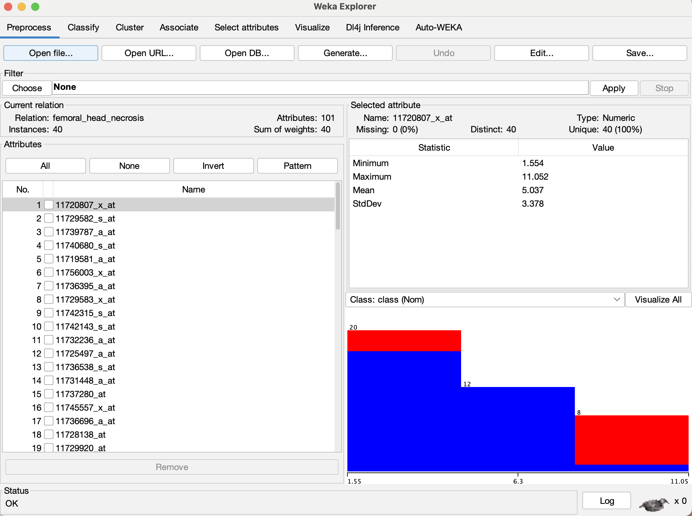

**NaiveBayes:**

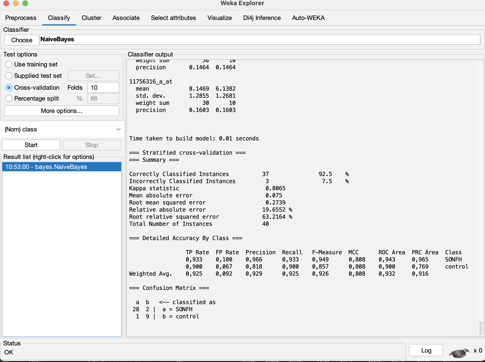

**RandomForest:**

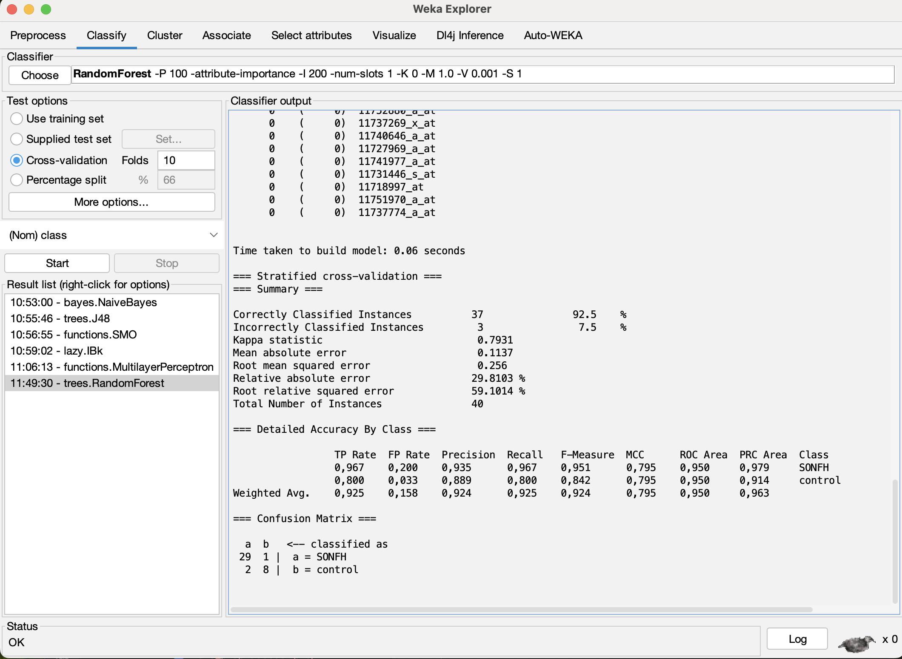

**SMO (SVM):**

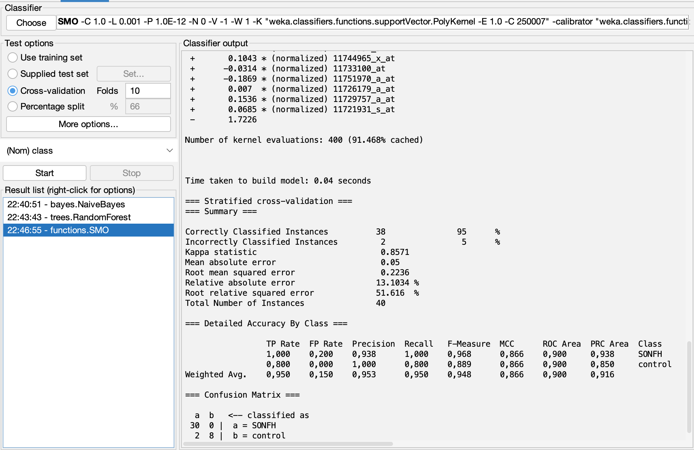

**IBk (k-NN):**

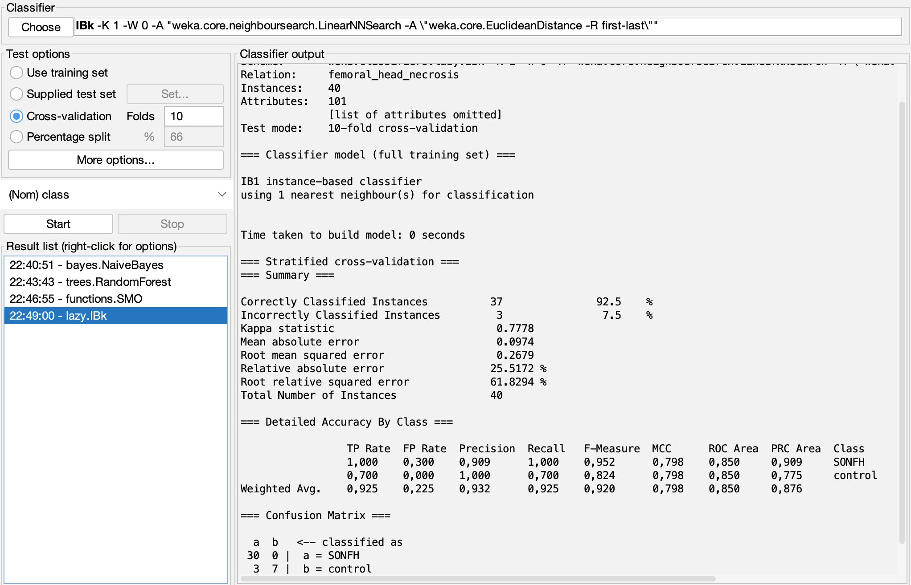

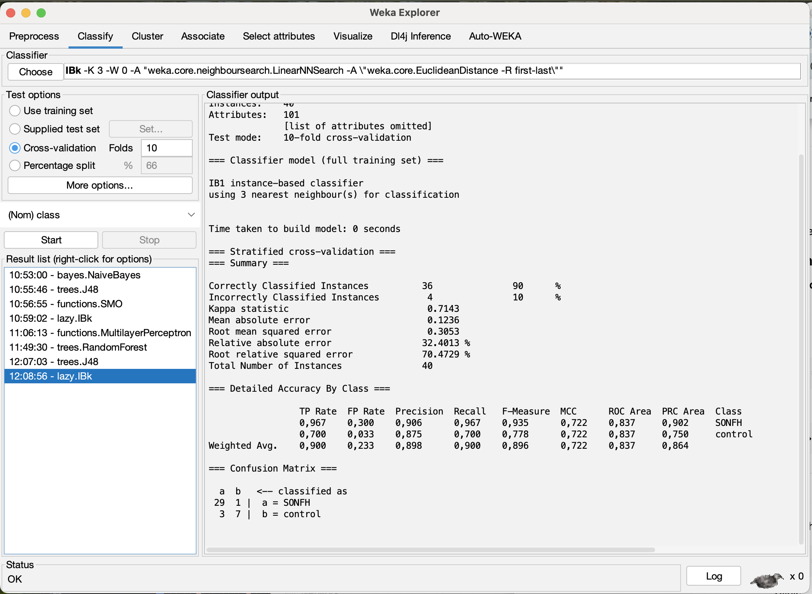

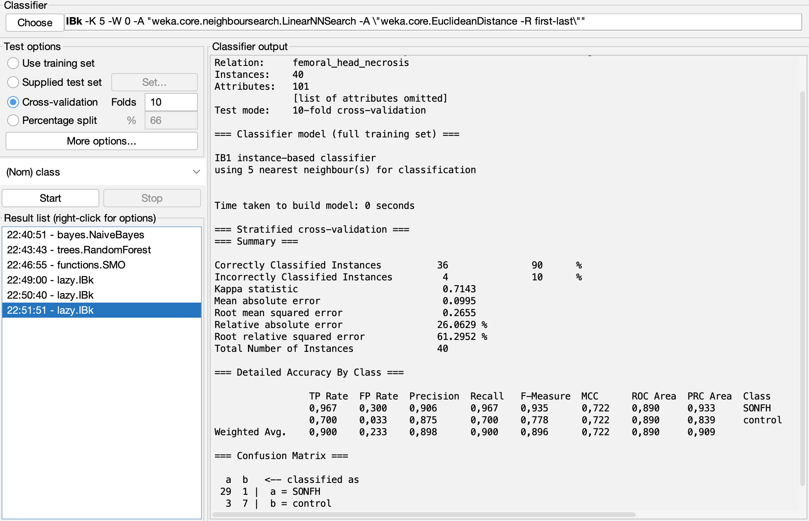

**MLP (MultilayerPerceptron):**

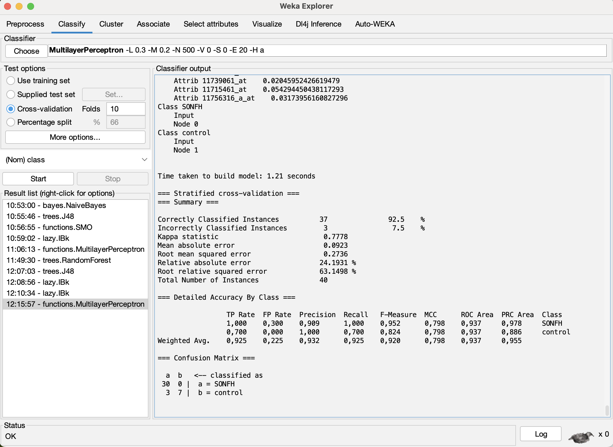

**MLP hyperparameters:**

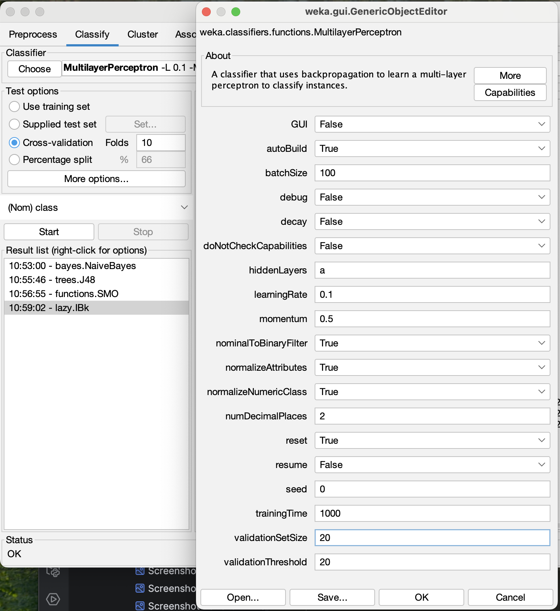

**J48 Decision Tree:**

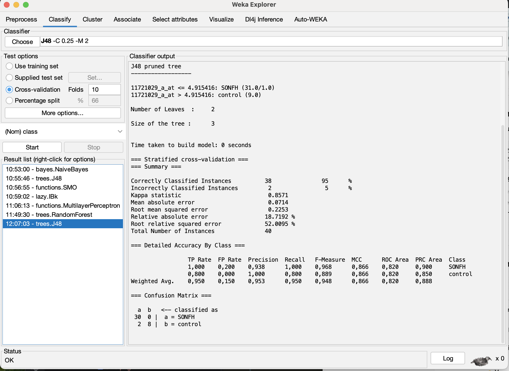

**Auto-Weka:**

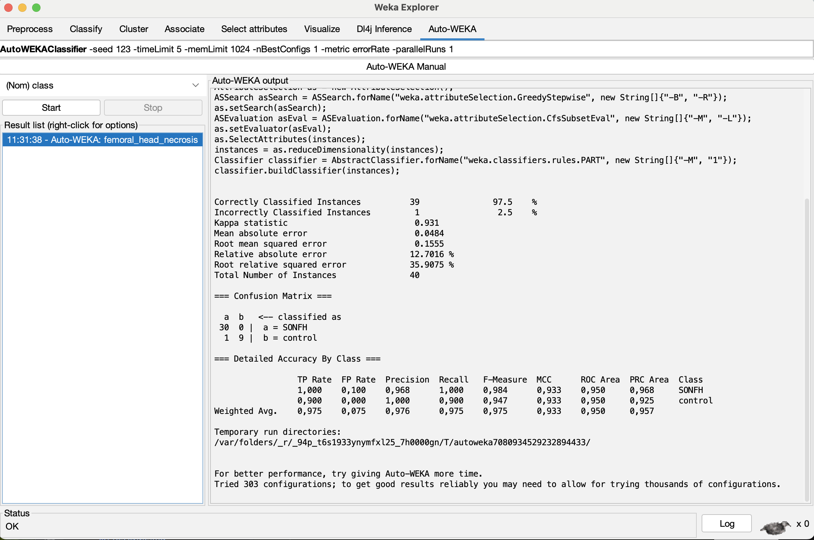

**Select Attributes (WrapperSubsetEval + RF):**

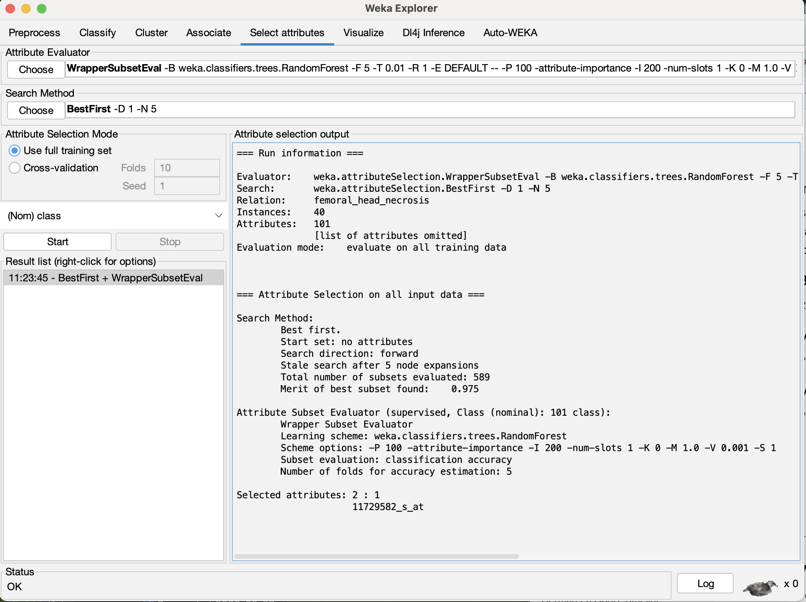

</details>

---

### Step 5 — Generate biomarker shortlists

Run after Weka is complete for each branch.

```bash
# Multivariate shortlist (defaults hardcoded — just run)
python3 generate_weka_biomarker_shortlist.py

# Univariate shortlist
python3 generate_weka_biomarker_shortlist.py \
  --rf    data/femoral_head_necrosis/weka_models/univariate_ann/randomforest.txt \
  --j48   data/femoral_head_necrosis/weka_models/univariate_ann/j48_tree.txt \
  --ranks data/femoral_head_necrosis/feature_selection/multivariate/gene_rankings.csv \
  --out   data/femoral_head_necrosis/weka_models/univariate_ann/weka_biomarker_shortlist.csv
```

> The `--ranks` argument always points to the multivariate `gene_rankings.csv` — it provides fold-change and gene symbol annotation for whichever probes the RF selected, regardless of which branch produced them.

Output columns: `probe_id`, `gene_symbol`, `rf_rank`, `rf_importance`, `j48_split`, `abs_fold_change`, `log_fc`, `hybrid_score`, `source`

---

### Step 6 — Generate Weka model comparison charts

```bash
python3 - <<'EOF'
import sys
sys.path.insert(0, "AutoOmics_ML_Pipeline")
from app.utils.feature_select import plot_weka_model_results

plot_weka_model_results(
    "data/femoral_head_necrosis/weka_models/multivariate",
    "data/femoral_head_necrosis/plots/multivariate/weka_model_comparison.png"
)
plot_weka_model_results(
    "data/femoral_head_necrosis/weka_models/univariate_ann",
    "data/femoral_head_necrosis/plots/univariate_ann/weka_model_comparison.png"
)
EOF
```

---

## Python Pipeline (Automated)

The automated pipeline in `AutoOmics_ML_Pipeline/` replicates and extends the Weka workflow using scikit-learn, XGBoost, hyperopt, and MLflow. It produces equivalent plots and biomarker shortlists with stronger statistical evaluation (50-fold repeated CV vs Weka's single 10-fold run).

```bash
cd AutoOmics_ML_Pipeline

# Full run from scratch
python -m app.main

# Skip parse/preprocess (re-run feature select + train + biomarker)
python -m app.main --skip-pre

# Univariate mode
python -m app.main --skip-pre --mode univariate

# LLM interpretation only
python -m app.main --skip-pre --skip-train --llm
```

See [`AutoOmics_ML_Pipeline/README.md`](AutoOmics_ML_Pipeline/README.md) for full documentation.

---

## Output Directory Structure

```
data/femoral_head_necrosis/
├── GSE123568_series_matrix.txt.gz   ← raw input (downloaded)
├── GSE123568_family.soft.gz         ← probe annotation (downloaded)
│
├── parsed/
│   ├── parsed_matrix.csv            ← Step 1 output: 40 × 49,293 probes + class
│   └── preprocessed_matrix.csv     ← Step 2 output: 40 × filtered probes + class
│
├── plots/
│   ├── eda/                         ← Step 3 output: 7 EDA plots
│   │   ├── volcano_plot.png
│   │   ├── fold_change_top20.png
│   │   ├── boxplots_top6.png
│   │   ├── sample_correlation.png
│   │   ├── heatmap_top20.png
│   │   ├── pca_plot.png
│   │   └── eda_composite.png        ← report Figure 1
│   ├── multivariate/                ← Step 6 output: Weka comparison chart
│   └── univariate_ann/              ← Step 6 output: Weka comparison chart
│
├── feature_selection/
│   ├── multivariate/                ← Step 3a output
│   │   ├── top100_features.arff     ← LOAD INTO WEKA (multivariate)
│   │   ├── top100_features.csv
│   │   ├── top500_features.csv
│   │   ├── gene_rankings.csv        ← used by shortlist script
│   │   ├── gene_level_rankings.csv
│   │   └── top100_genes.csv
│   └── univariate_ann/              ← Step 3b output
│       ├── top100_features_univariate_ann.arff   ← LOAD INTO WEKA (univariate)
│       ├── top100_features_univariate_ann.csv
│       └── filter_univariate_auc.csv
│
└── weka_models/
    ├── multivariate/                ← Step 4 output: Weka .txt result files
    │   ├── naive_bayes.txt
    │   ├── functions_smo.txt
    │   ├── multilayerpreceptron.txt
    │   ├── lazy_ibk_knn_1.txt
    │   ├── lazy_ibk_knn_3.txt
    │   ├── lazy_ibk_knn_5.txt
    │   ├── j48_tree.txt
    │   ├── randomforest.txt
    │   ├── select_attributes_randomforest.txt
    │   └── weka_biomarker_shortlist.csv   ← Step 5 output
    └── univariate_ann/              ← same structure, univariate run
```

---

<details>
<summary><strong>EDA — Exploratory Data Analysis</strong> (click to expand)</summary>

> Generated by `AutoOmics_ML_Pipeline/app/utils/feature_select.py`, saved to `data/femoral_head_necrosis/plots/eda/`.

The EDA plots run before the branch split and are identical for both multivariate and univariate approaches — they visualize the preprocessed data and the top probe landscape, not the final feature sets.

---

### EDA Composite

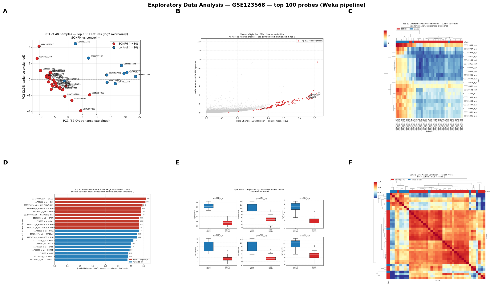

---

### 1 — The full feature landscape (Volcano-style plot)

> **"There are many potentially informative genes"** — shows the full landscape of filtered probes; our top 100 sit in the high-FC, high-variance corner.

Every dot is one probe that survived the IQR filter. The top 10 selected probes are labeled by gene name. The key insight: the top 100 probes are not just high fold change — they're also high variance, meaning they are likely informative candidates rather than flat background probes.

- **X-axis — |Fold Change|:** how different each probe's average expression is between SONFH and control patients, in log2 units.
- **Y-axis — Variance:** how much a probe's expression varies across all 40 patients.
- **Legend:** grey = all filtered probes; red = top 100 selected; top 10 labeled.


---

### 2 — Why these probes? — Top 20 by Fold Change

> **"We selected the most discriminative ones"** — top 20 probes ranked by how differently they're expressed in SONFH vs control.

Each bar = the absolute log2 fold change between SONFH and control. A value of 3.6 means the SONFH average is ~12× different from control (2³·⁶ ≈ 12).

- **X-axis — |Log Fold Change|:** magnitude of the difference in mean log2 expression.
- **Y-axis — Probe ID:** each bar is one probe, labeled by Affymetrix probe ID.
- **Legend:** dark red = top 10 by |FC|; blue = ranks 11–20. Both were selected.

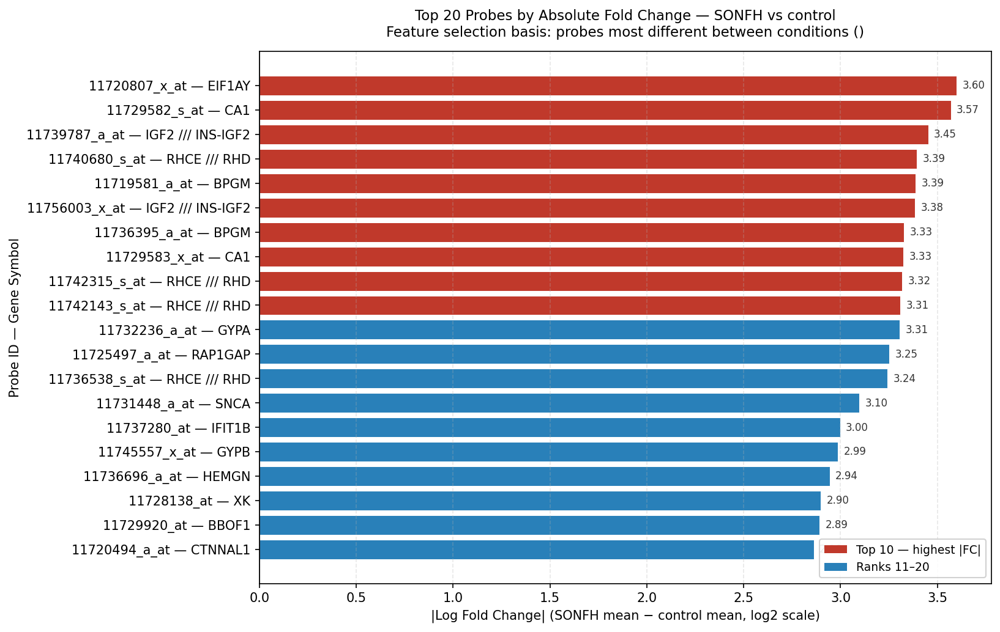

---

### 3 — Do individual top probes actually separate the groups? — Box plots (Top 6)

> **"These top probes clearly differ between classes"** — individual probe distributions for SONFH vs control, minimal overlap.

Each of the 6 panels shows one top probe. The box covers the middle 50% of values (IQR); the line inside is the median; whiskers extend to the furthest non-outlier value. For the top probes, the boxes barely overlap, confirming the genes are genuinely expressed differently — not just statistically selected artifacts.

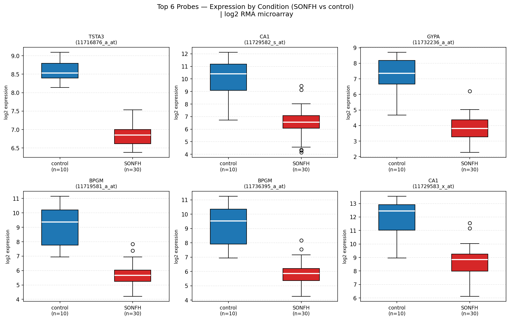

> **Interpretation note:** Several top-ranked probes (CA1, BPGM, RHCE/RHD, GYPA) show *lower* expression in SONFH than in controls. These genes are all associated with erythrocyte (red blood cell) function and oxygen transport. Their reduced signal in SONFH likely reflects a **systemic vascular or hematological shift** in the blood — consistent with the impaired blood supply that defines osteonecrosis — rather than direct transcriptional suppression. They are best understood as **biomarker signals that reflect the disease state**, not as genes causing it.

---

### 4 — Are SONFH patients similar to each other? — Sample Correlation Heatmap

> **"Patients cluster by disease state"** — all 40 patients, color-coded; SONFH patients are more similar to each other than to controls.

A 40×40 grid — one cell per pair of patients. Rows and columns are reordered by hierarchical clustering. If the disease signal is real, SONFH patients should form their own cluster and controls theirs.

- **Cell colour — Pearson correlation:** warm red = correlation close to 1.0 (nearly identical profiles); cool blue = lower correlation. Scale runs 0.7–1.0 — all samples are blood-derived human samples, so moderate baseline correlation is expected.
- **Sidebar colour bars:** red = SONFH patient; blue = control patient.

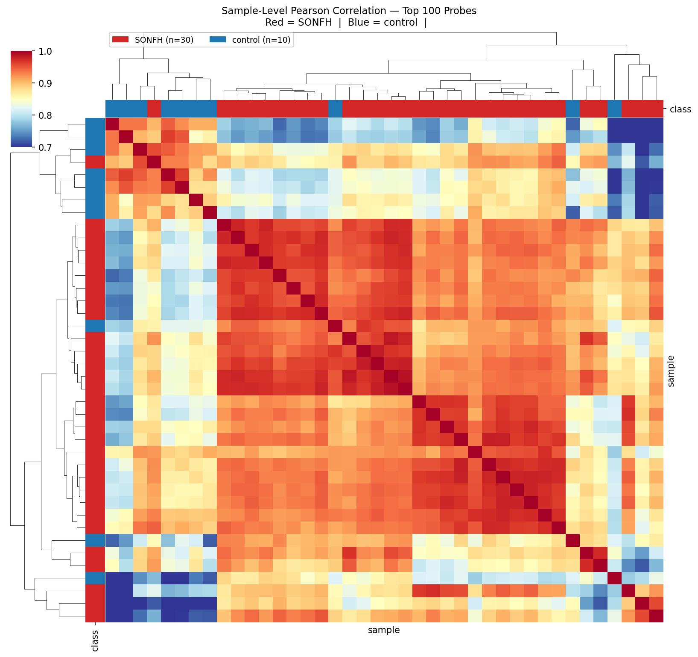

---

### 5 — Expression patterns — Heatmap (Top 20 Probes)

> **"The signal is consistent across patients"** — a different view of the same separation, showing all 20 top probes at once.

Log2 expression of the top 20 probes across all 40 samples. Block structure shows SONFH and control have distinct expression profiles — genes that are high in SONFH are consistently high across all 30 SONFH samples, not just a few outliers.

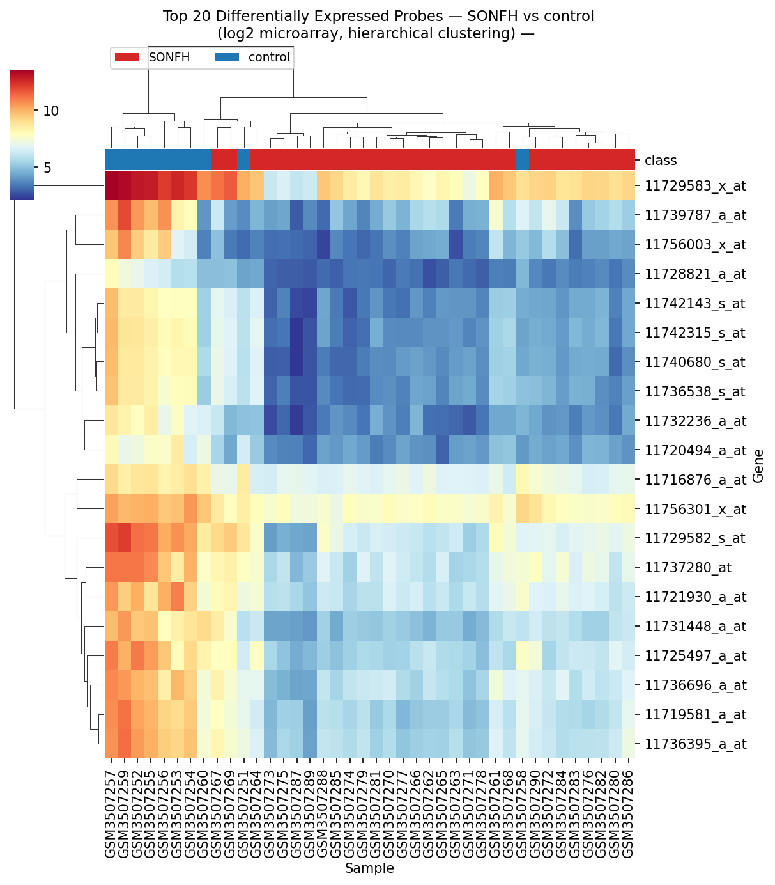

</details>

---

## Understanding the Data Files

### How microarray data is structured

Unlike single-cell RNA-seq (which produces enormous per-patient folders), microarray data puts **all 40 patients inside just 2 files**. There are no patient folders. All data lives in one table.

```
AutoOmics_ML_Pipeline/app/data/input/
├── GSE123568_series_matrix.txt.gz   ← ALL 40 patients × 49,293 probes
└── GSE123568_family.soft.gz         ← probe → gene symbol annotation
```

**`GSE123568_series_matrix.txt.gz`** has two parts:
- **Metadata header** (lines starting with `!`) — sample IDs, titles, disease status. The `disease:` characteristics line assigns class labels: `disease: non-SONFH` → `control` | `disease: SONFH` → `SONFH`
- **Data matrix** — tab-separated table, rows = probes (49,293), columns = patients (40). Each number is a log2 intensity value.

**`GSE123568_family.soft.gz`** is the probe annotation file. The `^PLATFORM = GPL15207` section maps each cryptic probe ID to a real gene name. Read on the fly by `feature_select.py` — no extraction needed.

### Why multiple probes map to the same gene

49,293 probes covering ~36,000 human genes means some genes have 2–4 probes each. This is intentional:

1. **Redundancy by design** — if one probe gets a bad reading (contamination, poor hybridization), the others still work.
2. **Alternative splicing** — one gene can produce multiple mRNA isoforms; different probes target different versions.
3. **Probe type suffixes** — Affymetrix encodes this in the probe ID:

| Suffix | What it means |
|--------|--------------|
| `_at` | Standard probe — matches one specific gene |
| `_s_at` | "Shared" — matches multiple transcripts of the *same* gene |
| `_x_at` | "Cross-hybridizing" — matches sequences across *multiple different genes* (least specific) |

**What this means for results:** When `feature_select.py` picks the top 100 probes, it might include 3 probes all pointing to the same gene. That gene is effectively counted 3 times. This is not an error — it reinforces the signal. When writing the Discussion, report *gene names*, not probe counts. Use `gene_level_rankings.csv` (one best probe per gene, deduped) for the literature-facing gene list.

---

<details>
<summary><strong>The 40 samples — who they are</strong> (click to expand)</summary>

| GSM ID | Title in file | Disease | Gender | Pipeline label |
|--------|--------------|---------|--------|----------------|
| GSM3507251 | control group, patient 1 | non-SONFH | Female | `control` |
| GSM3507252 | control group, patient 2 | non-SONFH | Male | `control` |
| GSM3507253 | control group, patient 3 | non-SONFH | Male | `control` |
| GSM3507254 | control group, patient 4 | non-SONFH | Male | `control` |
| GSM3507255 | control group, patient 5 | non-SONFH | Male | `control` |
| GSM3507256 | control group, patient 6 | non-SONFH | Male | `control` |
| GSM3507257 | control group, patient 7 | non-SONFH | Male | `control` |
| GSM3507258 | control group, patient 8 | non-SONFH | Female | `control` |
| GSM3507259 | control group, patient 9 | non-SONFH | Male | `control` |
| GSM3507260 | control group, patient 10 | non-SONFH | Female | `control` |
| GSM3507261 | disease group, patient 1 | SONFH | Male | `SONFH` |
| GSM3507262 | disease group, patient 2 | SONFH | Male | `SONFH` |
| GSM3507263 | disease group, patient 3 | SONFH | Female | `SONFH` |
| GSM3507264 | disease group, patient 4 | SONFH | Female | `SONFH` |
| GSM3507265 | disease group, patient 5 | SONFH | Male | `SONFH` |
| GSM3507266 | disease group, patient 6 | SONFH | Male | `SONFH` |
| GSM3507267 | disease group, patient 7 | SONFH | Male | `SONFH` |
| GSM3507268 | disease group, patient 8 | SONFH | Female | `SONFH` |
| GSM3507269 | disease group, patient 9 | SONFH | Female | `SONFH` |
| GSM3507270 | disease group, patient 10 | SONFH | Male | `SONFH` |
| GSM3507271 | disease group, patient 11 | SONFH | Male | `SONFH` |
| GSM3507272 | disease group, patient 12 | SONFH | Male | `SONFH` |
| GSM3507273 | disease group, patient 13 | SONFH | Male | `SONFH` |
| GSM3507274 | disease group, patient 14 | SONFH | Male | `SONFH` |
| GSM3507275 | disease group, patient 15 | SONFH | Male | `SONFH` |
| GSM3507276 | disease group, patient 16 | SONFH | Female | `SONFH` |
| GSM3507277 | disease group, patient 17 | SONFH | Female | `SONFH` |
| GSM3507278 | disease group, patient 18 | SONFH | Female | `SONFH` |
| GSM3507279 | disease group, patient 19 | SONFH | Female | `SONFH` |
| GSM3507280 | disease group, patient 20 | SONFH | Male | `SONFH` |
| GSM3507281 | disease group, patient 21 | SONFH | Female | `SONFH` |
| GSM3507282 | disease group, patient 22 | SONFH | Female | `SONFH` |
| GSM3507283 | disease group, patient 23 | SONFH | Female | `SONFH` |
| GSM3507284 | disease group, patient 24 | SONFH | Female | `SONFH` |
| GSM3507285 | disease group, patient 25 | SONFH | Female | `SONFH` |
| GSM3507286 | disease group, patient 26 | SONFH | Male | `SONFH` |
| GSM3507287 | disease group, patient 27 | SONFH | Female | `SONFH` |
| GSM3507288 | disease group, patient 28 | SONFH | Female | `SONFH` |
| GSM3507289 | disease group, patient 29 | SONFH | Female | `SONFH` |
| GSM3507290 | disease group, patient 30 | SONFH | Female | `SONFH` |

**Gender breakdown:**
- Control: 3 Female, 7 Male
- SONFH: 17 Female, 13 Male
- Combined: 20 Female, 20 Male — balanced overall, but unequal within groups. Worth mentioning as a potential confound in the Discussion.

</details>

---

## Weka vs Python Pipeline: Methodology Comparison

**Where Weka stands out:** J48 achieved 95% with a single decision split — one probe at a threshold correctly classifies 38/40 samples. This is a biomarker finding more than a classifier result. Auto-WEKA searched 300+ algorithm+hyperparameter configurations.

**Where Python pipeline is better:** AUC and balanced accuracy are the correct metrics for 30:10 class imbalance. A model that always predicts SONFH would be 75% accurate. Python's balanced accuracy confirms models are learning both classes. The 50-fold evaluation is statistically far more reliable — Weka's single 10-fold run cannot report standard deviations. A finding with `selection_freq = 1.0` across 50 folds is far more trustworthy than an importance score from a single run.

**Gene-level differences between pipelines:** Weka RF is dominated by 3 correlated blood-type probes (RHD/RHCE/XK) that can overwhelm the Gini metric in a single run. The Python pipeline ranks **BPGM** (bisphosphoglycerate mutase) first — a red blood cell enzyme that regulates 2,3-BPG, which directly controls oxygen release from hemoglobin to tissues. For a disease caused by bone ischemia, BPGM is a mechanistically stronger candidate. The genes that appear in *both* pipelines (CA1, GYPA, RHD/RHCE) are the highest-confidence shortlist candidates.

### Model Comparison Figures

**Weka classifier results (multivariate branch)**

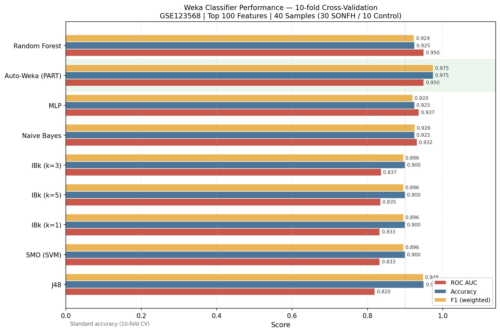

**Python pipeline results**

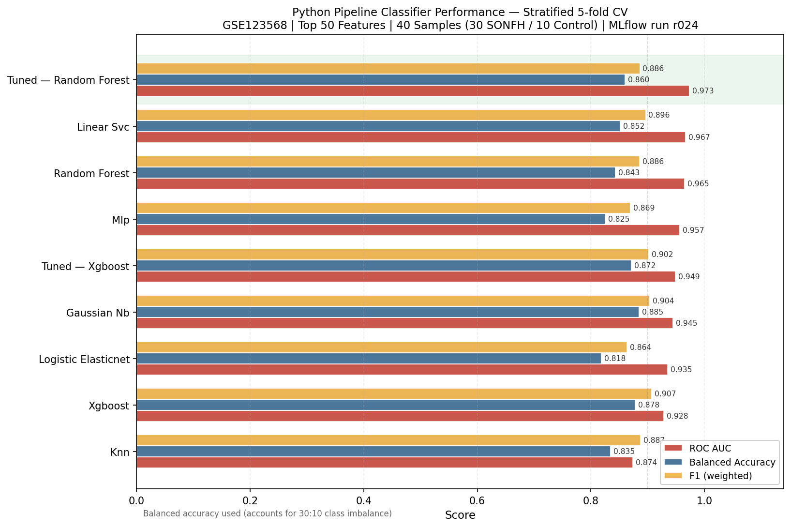

---

## LLM Biological Interpretation

The Agentic RAG stage runs after biomarker shortlist generation. For each gene, the agent executes a multi-step retrieval-reasoning loop (up to 4 iterations), autonomously selecting from 8 registered tools (NCBI Gene, UniProt, Open Targets, PubMed, PMC fulltext, GEO, Wikipedia) to accumulate evidence before producing a final structured JSON output.

**Running the LLM stage:**

```bash
cd AutoOmics_ML_Pipeline

# Weka multivariate shortlist
python -m app.main --skip-pre --skip-train --llm --shortlist ../data/femoral_head_necrosis/weka_models/multivariate/weka_biomarker_shortlist.csv

# Weka univariate shortlist
python -m app.main --skip-pre --skip-train --llm --shortlist ../data/femoral_head_necrosis/weka_models/univariate_ann/weka_biomarker_shortlist.csv

# Python pipeline (uses internally generated shortlist)
python -m app.main --skip-pre --skip-train --llm
```

> `--skip-pre --skip-train` skips preprocessing and model training. Add `--shortlist` to pass an external CSV (e.g. from Weka); omit it to use the shortlist generated by the Python pipeline's own feature selection run.

**JSON output format** — one file per gene written to `app/data/output/llm_outputs/`:

```json
{
  "file": "BPGM.json",
  "probe_id": "11719581_a_at",
  "gene_symbol": "BPGM",
  "evidence_tier": "Tier 1",
  "evidence_relation": "direct",
  "evidence_confidence": "high",
  "biomarker_potential": "strong",
  "score": 0.6801,
  "abs_fold_change": 3.3879618999999996,
  "relevance_summary": "BPGM is implicated in the pathophysiology of steroid-induced osteonecrosis of the femoral head and has been identified as a potential biomarker for early detection of this condition.",
  "citations": [
    "BPGM (P07738). https://www.uniprot.org/uniprotkb/P07738",
    "BPGM — BPGM. https://platform.opentargets.org/target/ENSG00000172331",
    "BPGM ↔ hemolytic anemia due to diphosphoglycerate mutase deficiency. https://platform.opentargets.org/target/ENSG00000172331/associations",
    "BPGM ↔ autosomal recessive secondary polycythemia not associated with VHL gene. https://platform.opentargets.org/target/ENSG00000172331/associations",
    "BPGM ↔ placenta praevia. https://platform.opentargets.org/target/ENSG00000172331/associations",
    "BPGM ↔ vertebral column disorder. https://platform.opentargets.org/target/ENSG00000172331/associations",
    "Screening of Potential Biomarkers in the Peripheral Serum for Steroid-Induced Osteonecrosis of the Femoral Head Based on WGCNA and Machine Learning Algorithms. (2022). https://pubmed.ncbi.nlm.nih.gov/35154510/",
    "BPGM — bisphosphoglycerate mutase (NCBI Gene). https://www.ncbi.nlm.nih.gov/gene/",
    "AKT1 — AKT serine/threonine kinase 1 (NCBI Gene). https://www.ncbi.nlm.nih.gov/gene/",
    "GRB2 — growth factor receptor bound protein 2 (NCBI Gene). https://www.ncbi.nlm.nih.gov/gene/",
    "GAPDH — glyceraldehyde-3-phosphate dehydrogenase (NCBI Gene). https://www.ncbi.nlm.nih.gov/gene/",
    "ATF6 — activating transcription factor 6 (NCBI Gene). https://www.ncbi.nlm.nih.gov/gene/",
    "Bioinformatics analysis and identification of genes and molecular pathways in steroid-induced osteonecrosis of the femoral head (PMC full text). https://pmc.ncbi.nlm.nih.gov/articles/PMC8136174/",
    "Advances in the mechanism for steroid-induced osteonecrosis of the femoral head (PMC full text). https://pmc.ncbi.nlm.nih.gov/articles/PMC12902040/",
    "Pathological mechanisms and related markers of steroid-induced osteonecrosis of the femoral head (PMC full text). https://pmc.ncbi.nlm.nih.gov/articles/PMC11559024/",
    "Transcriptomic analysis reveals genetic factors regulating early steroid-induced osteonecrosis of the femoral head (PMC full text). https://pmc.ncbi.nlm.nih.gov/articles/PMC9478254/",
    "MEF cells, siBPGM control 5 [GSM6037560] (GEO). https://www.ncbi.nlm.nih.gov/geo/query/acc.cgi?acc=GSM6037560",
    "MEF cells, siBPGM control 2 [GSM6037557] (GEO). https://www.ncbi.nlm.nih.gov/geo/query/acc.cgi?acc=GSM6037557",
    "MEF cells, siBPGM control 4 [GSM6037559] (GEO). https://www.ncbi.nlm.nih.gov/geo/query/acc.cgi?acc=GSM6037559",
    "MEF cells, siBPGM control 3 [GSM6037558] (GEO). https://www.ncbi.nlm.nih.gov/geo/query/acc.cgi?acc=GSM6037558",
    "A renal function for 2,3-bisphosphoglycerate mutase (BPGM) [GSE200544] (GEO). https://www.ncbi.nlm.nih.gov/geo/query/acc.cgi?acc=GSE200544"
  ]
}
```

**Evidence tiers:**
- **Tier 1** — human biomarker evidence directly tied to SONFH, matching study modality where possible
- **Tier 2** — human disease-specific mechanistic or association evidence
- **Tier 3** — human evidence in disease-adjacent biology
- **Tier 4** — animal, cell-line, speculative, or weakly grounded support only

**Relation types:** `direct` (source explicitly links gene to SONFH), `indirect` (biologically relevant pathway support), `inferred` (general gene biology, weak disease-specific grounding).

Filtered best-run outputs (Tier 1–3, direct + indirect) are stored in `report/best_runs/` and feed the cross-pipeline audit script:

```bash
python report/llm_output_scraper.py --analyze-all --input report/best_runs
```

---

<details>
<summary><strong>Glossary — Key Terms</strong> (click to expand)</summary>

### Biology & Genomics

| Term | What it means |
|------|---------------|
| **Gene expression** | How actively a gene is being "read" by a cell at a given moment. DNA contains the instructions; mRNA is the photocopy the cell makes to actually use those instructions. Expression level = how many copies of that mRNA are present. |
| **mRNA (messenger RNA)** | The intermediate molecule between a gene (DNA) and a protein. Microarrays and RNA-seq both measure mRNA levels — not DNA, not protein. |
| **Transcriptome** | The complete set of all mRNA molecules in a cell or tissue at a specific moment. Measuring the transcriptome tells you which genes are active. |
| **Microarray** | A glass chip with thousands of pre-printed probes. Blood RNA hybridizes to matching probes; fluorescence intensity = expression level. Only measures known genes. |
| **Probe** | A short DNA sequence on the microarray chip that matches one gene. Affymetrix PrimeView has 49,293 probes covering ~36,000 genes. |
| **RMA normalization** | Robust Multi-Array Average — background correction + normalization already applied by GEO submitter. Values are in log2 scale. |
| **log2 intensity** | The measured expression value. A value of 7 = 2⁷ = 128 units of signal. Each +1 step is a doubling of expression. |
| **Fold change** | How much more or less a gene is expressed in one group vs another. log2 FC = 2 means 4× more expression in one group (2² = 4). |
| **IQR (Interquartile Range)** | The range between the 25th and 75th percentile of a probe's expression across all 40 samples. Low IQR = flat probe (remove). High IQR = variable probe (keep). |

### Machine Learning

| Term | What it means |
|------|---------------|
| **Feature selection** | Choosing which of the 49,293 probes to give to the classifier. The top 100 by hybrid score are used. |
| **ARFF** | Attribute-Relation File Format — Weka's native data format. Each row is one patient; each column is one gene + the class label. |
| **10-fold cross-validation** | Split 40 patients into 10 groups of 4. Train on 9 groups, test on 1. Repeat 10 times, average the results. Required because n=40 is too small to hold out a fixed test set. |
| **Kappa statistic (κ)** | Measures agreement between predictions and true labels, adjusted for chance. κ=0 means no better than random; κ=1 means perfect. More informative than accuracy for imbalanced classes. |
| **AUC (Area Under ROC Curve)** | Probability that the model ranks a random SONFH patient higher than a random control. AUC=0.5 = random; AUC=1.0 = perfect. Preferred metric for imbalanced classes. |
| **Gini impurity** | What RandomForest uses to decide which probe to split on at each tree node. Lower impurity = purer split. Attribute importance = how much each probe reduced impurity across all trees. |
| **Hybrid score** | zscore(|log2 FC|) + zscore(|Welch t-stat|). Combines effect size (fold change) with statistical consistency (t-stat). Used to rank probes for feature selection. |

### Tools

| Term | What it means |
|------|---------------|
| **Weka** | Waikato Environment for Knowledge Analysis — Java-based ML GUI. Used for manual classifier runs in this project. |
| **Weka Explorer** | The main Weka GUI. Preprocess tab loads data; Classify tab runs classifiers; Select Attributes tab runs feature selection. |
| **ARFF relation** | The `@RELATION` field in an ARFF file. Weka shows this as "Current relation" in the Preprocess tab. |
| **MLflow** | Experiment tracking system used by the Python pipeline to log metrics, parameters, and artifacts across runs. |

</details>

---

> All generated files are gitignored. Fully reproducible by running the steps above in order.
