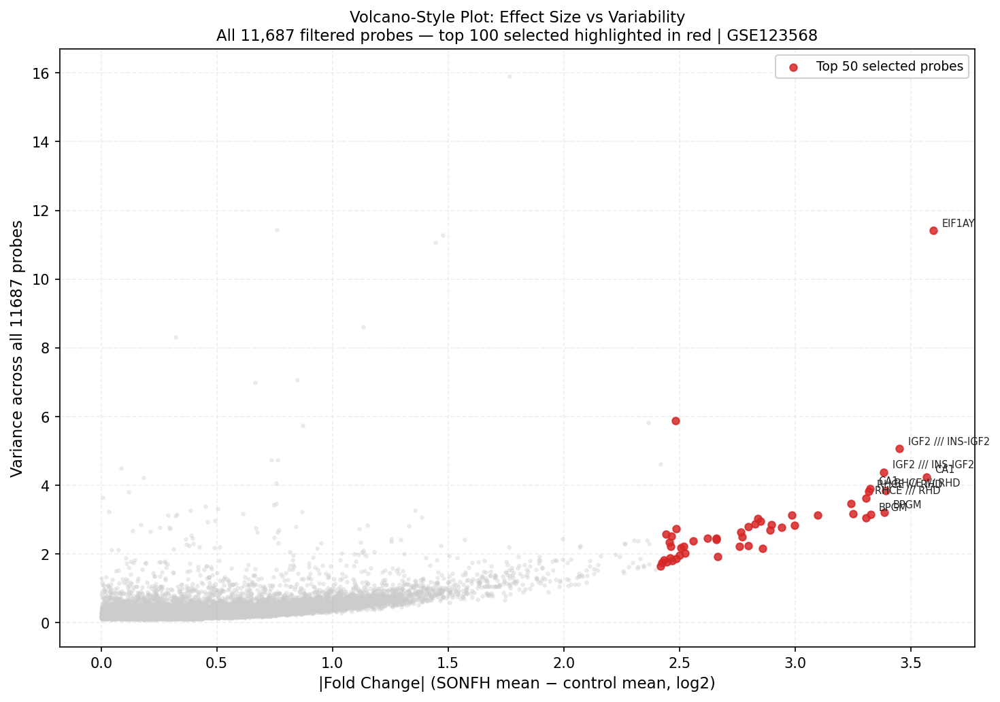
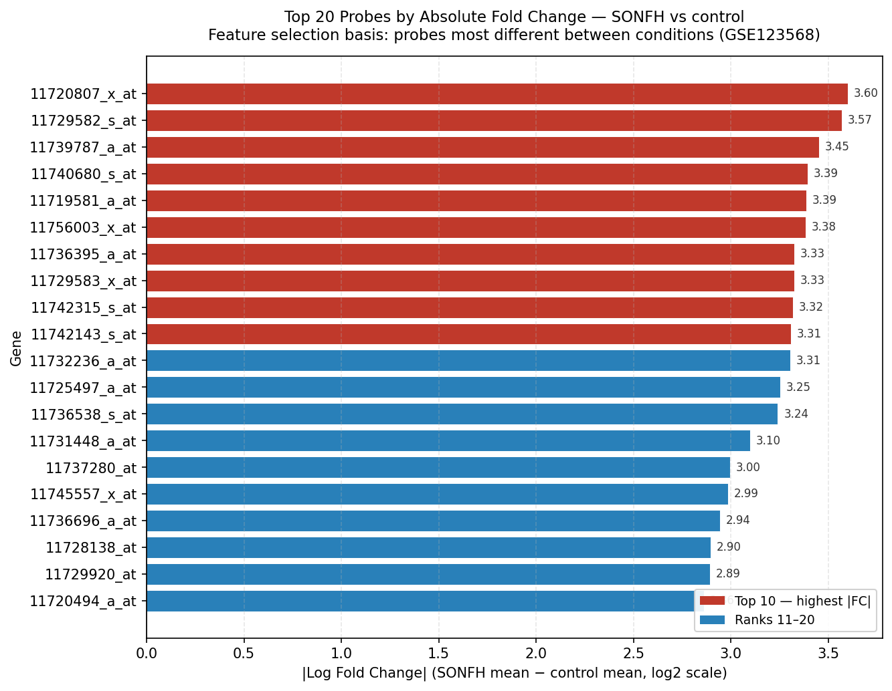
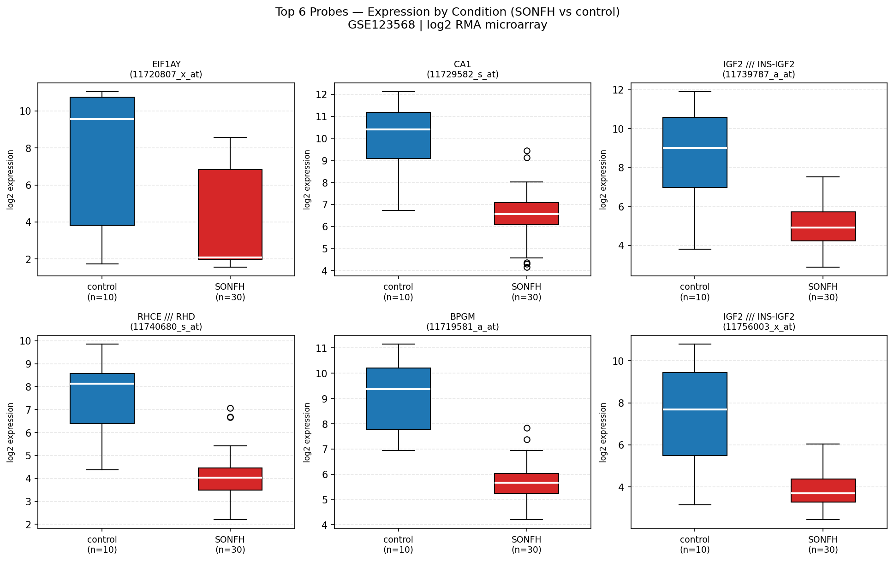
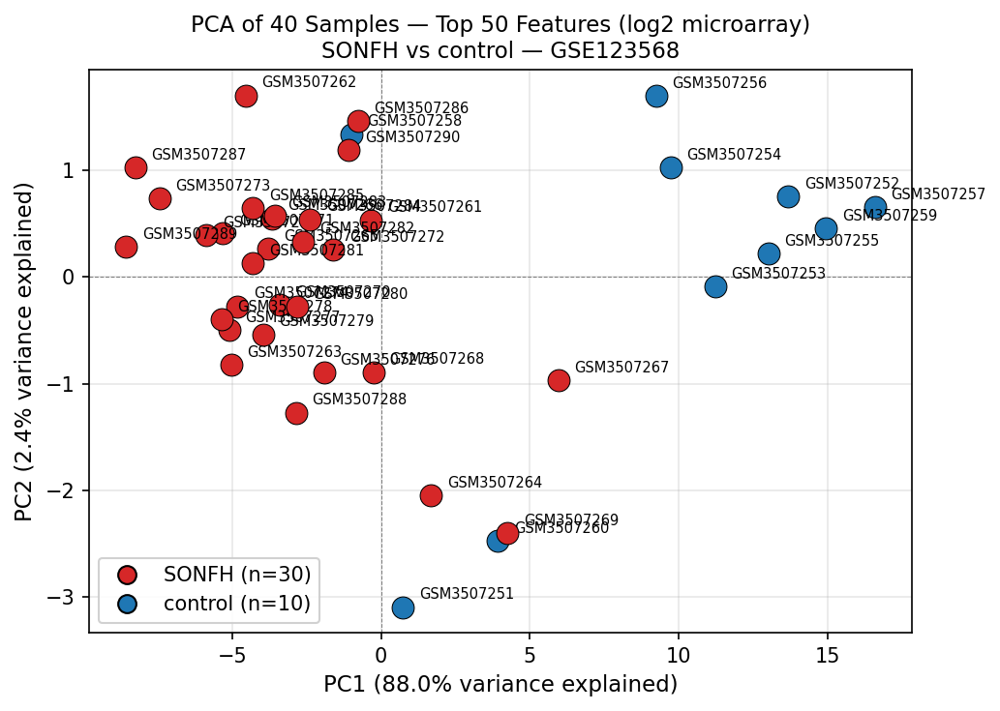
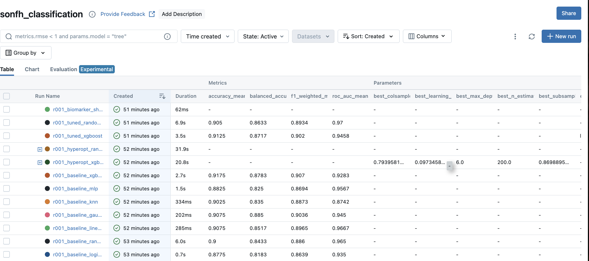
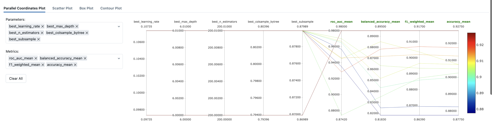

# omics_ml_pipeline

Python ML pipeline for SONFH biomarker discovery — parallel to the manual Weka capstone workflow.

Turns a classroom no-code Weka exercise into a reproducible, experiment-tracked Python ML pipeline.

---

## What this is

The capstone course uses Weka (GUI-based) for classification. This app replicates and extends that workflow in Python:

| Capstone (manual) | This app |
|---|---|
| Weka GUI | scikit-learn + XGBoost |
| Manual classifier runs | Automated pipeline via `app/main.py` |
| No experiment tracking | MLflow with full web UI |
| Single 10-fold CV run per model | RepeatedStratifiedKFold (50 evaluations per model) |
| No hyperparameter tuning | Hyperopt TPE search (50 trials × 2 models) |
| Manual biomarker shortlist | Auto-generated `biomarker_shortlist.csv` |
| No EDA plots from pipeline | 4 EDA plots generated automatically |

Both pipelines share the same preprocessing logic (`app/utils/`). The automated pipeline feeds the same LLM interpretation stage (Phase 6).

---

## Structure

```
omics_ml_pipeline/
├── app/
│   ├── main.py               ← pipeline entry point
│   ├── config/
│   │   └── pipeline.yaml     ← all paths, params, MLflow config
│   ├── data/
│   │   ├── input/            ← raw dataset files (drop any GEO dataset here)
│   │   │   ├── GSE123568_series_matrix.txt.gz
│   │   │   ├── GSE123568_family.soft.gz
│   │   │   └── GSE123568_abstract.txt
│   │   └── output/           ← all generated files (safe to delete & regenerate)
│   │       ├── parsed/
│   │       ├── feature_selection/
│   │       │   ├── top50_features.csv
│   │       │   ├── gene_rankings.csv
│   │       │   └── gene_level_summary.csv
│   │       ├── models/
│   │       │   └── model_comparison.csv
│   │       ├── plots/
│   │       │   ├── volcano_plot.png
│   │       │   ├── fold_change_top20.png
│   │       │   ├── boxplots_top6.png
│   │       │   └── pca_plot.png
│   │       ├── llm_outputs/  ← one JSON per gene (Phase 6)
│   │       └── biomarker_shortlist.csv
│   ├── jobs/                 ← orchestration layer
│   │   ├── ingest_job.py
│   │   ├── parse_job.py
│   │   ├── preprocess_job.py
│   │   ├── feature_select_job.py
│   │   ├── train_eval_job.py
│   │   ├── biomarker_job.py
│   │   └── llm_job.py        ← scaffold (Phase 6)
│   ├── models/
│   │   └── baseline_models.py
│   └── utils/                ← shared logic (also used by manual Weka workflow)
│       ├── parse_series_matrix.py
│       ├── preprocess.py
│       ├── feature_select.py
│       ├── io_utils.py
│       ├── mlflow_utils.py
│       └── logging_utils.py
├── docker-compose.yml        ← MLflow service
├── Dockerfile
└── requirements.txt
```

---

## Quickstart

**All commands run from `omics_ml_pipeline/`.**

### 1. Start MLflow (required before running the pipeline)

```bash
docker compose up -d
```

MLflow UI → http://localhost:5002

Stop when done:
```bash
docker compose down
```

### 2. Create environment and install dependencies

```bash
conda create -n omics python=3.13
conda activate omics
pip install -r requirements.txt
```

### 3. Run the pipeline

```bash
# Full pipeline (ingest → parse → preprocess → feature_select → train → biomarker)
python -m app.main

# Full pipeline + LLM interpretation
python -m app.main --llm

# Skip ingest/parse/preprocess — re-run models + biomarker on existing data
python -m app.main --skip-pre

# Skip pre + run LLM (most common on subsequent runs)
python -m app.main --skip-pre --llm

# LLM only — skip everything except feature_select and biomarker
python -m app.main --skip-pre --skip-train --llm
```

| Flag | Effect |
|---|---|
| *(none)* | Full pipeline |
| `--skip-pre` | Skip ingest, parse, preprocess (use existing outputs) |
| `--skip-train` | Skip model training |
| `--llm` | Run LLM biological interpretation (opt-in) |

### 4. Running long jobs (Mac local)

The `--llm` step runs for several minutes per gene and must not be interrupted.
Use `caffeinate` to prevent the Mac from sleeping and `tee` to save a live log.

```bash
# Official run command
export OPENAI_API_KEY=sk-...
caffeinate -i python -u -m app.main --skip-pre --llm 2>&1 | tee llm_run_$(date +%Y%m%d_%H%M%S).log
```

| Flag | Effect |
|---|---|
| `caffeinate -i` | Prevents the Mac from sleeping while the job runs |
| `python -u` | Forces unbuffered stdout — logs appear immediately |
| `2>&1 \| tee ...` | Shows logs live in the terminal and saves them to a timestamped file |

Monitor and inspect the run:

```bash
# Follow the latest log in a second terminal
tail -f llm_run_*.log

# Check output files being written
ls -lt app/data/output/llm_outputs/ | head

# Filter key progress lines
grep -a "\[ITER\|\[START\|\[DONE\|\[FAIL\|\[WRITE\|\[AGENT" llm_run_*.log
```

### 5. View results

- MLflow UI: http://localhost:5002 → experiment `sonfh_classification`
- Model comparison CSV: `app/data/output/models/model_comparison.csv`
- Biomarker shortlist: `app/data/output/biomarker_shortlist.csv`
- EDA plots: `app/data/output/plots/`

---

## Pipeline Results

All results below are from the run using top 50 probes by fold-change, evaluated with `RepeatedStratifiedKFold(n_splits=5, n_repeats=10)` = 50 CV evaluations per model. Dataset: GSE123568, 40 samples (30 SONFH / 10 control).

### Model comparison

| Model | Source | AUC (mean) | Balanced acc | F1 (weighted) |
|---|---|---|---|---|
| tuned_random_forest | hyperopt_tuned | **0.9700** | 0.863 | 0.893 |
| baseline_linear_svc | baseline_default | 0.9667 | 0.852 | 0.897 |
| baseline_random_forest | baseline_default | 0.9650 | 0.843 | 0.886 |
| tuned_xgboost | hyperopt_tuned | 0.9458 | 0.872 | 0.902 |
| baseline_mlp | baseline_default | 0.9567 | 0.825 | 0.869 |
| baseline_gaussian_nb | baseline_default | 0.9450 | 0.885 | 0.904 |
| baseline_logistic_elasticnet | baseline_default | 0.9350 | 0.818 | 0.864 |
| baseline_xgboost | baseline_default | 0.9283 | 0.878 | 0.907 |
| baseline_knn | baseline_default | 0.8742 | 0.835 | 0.887 |

**Winner: tuned_random_forest (AUC 0.970).** Hyperopt found better RF params (+0.005 AUC over baseline RF). XGBoost improved modestly with tuning (+0.018 AUC over baseline XGBoost). LinearSVC performed surprisingly well with 50 features — linear models benefit from the reduced feature count.

All models use `class_weight="balanced"` to correct for the 30:10 class imbalance. Balanced accuracy is reported alongside AUC because a naive majority-class predictor would be 75% accurate on this dataset — accuracy alone is not a reliable metric here.

---

### Hyperopt results

XGBoost best params (50-trial TPE search):
```
learning_rate=0.097, max_depth=6, n_estimators=200
subsample=0.870, colsample_bytree=0.794
reg_alpha=0.058, reg_lambda=0.134
```

RandomForest best params:
```
n_estimators=250, max_depth=15, min_samples_split=6, max_features=sqrt
```

Hyperopt trials use `StratifiedKFold(n_splits=5)` for speed. Final tuned evaluation uses the full `RepeatedStratifiedKFold(5×10)` so results are directly comparable to baseline.

---

### EDA plots

Generated automatically by `feature_select_job.py` on each pipeline run.

**Volcano plot** — full landscape of 11,687 filtered probes; top 50 highlighted:



---

**Top 20 probes by fold-change:**



---

**Box plots — top 6 probes, SONFH vs control:**



---

**PCA — PC1 = 88.0%, PC2 = 2.4% (total 90.4% in 2 dimensions):**



> Strong separation: 88% of all expression variance captured in a single axis, clearly separating SONFH from control. Slightly stronger than the 100-probe run (PC1=84.6%) — reducing feature count from 100 to 50 removed noise and sharpened the signal.

---

### MLflow experiment tracking

All pipeline runs are logged to MLflow automatically. These screenshots show the experiment UI from the final run.

**Runs table — every baseline, hyperopt search, tuned model, and biomarker run in one view:**



> Each row is a tracked MLflow run from the `sonfh_classification` experiment. Runs are prefixed `r001_` so all runs from a single pipeline execution are visually grouped. Metrics (accuracy, balanced accuracy, F1, AUC) and hyperopt best-params are stored as columns, making it straightforward to filter or sort. The hyperopt parent runs (`r001_hyperopt_xgboost_search`, `r001_hyperopt_random_forest_search`) show the best params found; the tuned evaluation runs below them show the final held-out performance. This is the experiment tracking capability that Weka lacks entirely — every run is reproducible, timestamped, and queryable.

---

**Parallel coordinates plot — hyperopt parameter sweeps vs metric outcomes:**



> MLflow's parallel coordinates view maps each parameter combination (learning rate, max depth, n_estimators, subsample) to its resulting metrics (AUC, balanced accuracy, F1, accuracy) via connecting lines. Lines that converge on the high-AUC end of the right axes trace back to the winning parameter regions. This reiterates the same signal seen in the EDA plots — a clear, learnable separation in the data — but from the model's perspective: the fact that many different parameter combinations all achieve high AUC (colour-coded warm = high) confirms the signal is robust, not dependent on a lucky hyperparameter choice.

---

### Biomarker shortlist

Generated by `biomarker_job.py`: RF feature importance (across 5 CV folds) × fold-change, normalised and averaged into a `combined_score`.

**Top 20 candidates — fixed shortlist (50-probe input, 20-probe output):**

The shortlist includes all probes with `combined_score >= 0.60` — a threshold-based cutoff rather than an arbitrary top-N, ensuring every included probe has genuine signal on both RF importance and fold-change. All shortlisted probes appeared in every CV fold (selection_freq = 1.00).

| Rank | Probe | Gene | Combined score | Selection freq |
|---|---|---|---|---|
| 1 | 11719581_a_at | **BPGM** | 0.934 | 1.00 |
| 2 | 11758559_s_at | **NUDT4** | 0.836 | 1.00 |
| 3 | 11736395_a_at | **BPGM** | 0.813 | 1.00 |
| 4 | 11732236_a_at | **GYPA** | 0.791 | 1.00 |
| 5 | 11720494_a_at | **CTNNAL1** | 0.775 | 1.00 |
| 6 | 11750918_a_at | **HEPACAM2** | 0.722 | 1.00 |
| 7 | 11736696_a_at | **HEMGN** | 0.713 | 1.00 |
| 8 | 11728821_a_at | **HEPACAM2** | 0.713 | 1.00 |
| 9 | 11732235_a_at | **GYPA** | 0.688 | 1.00 |
| 10 | 11725497_a_at | **RAP1GAP** | 0.687 | 1.00 |
| 11 | 11721930_a_at | **TMCC2** | 0.651 | 1.00 |
| 12 | 11739787_a_at | **IGF2** | 0.630 | 1.00 |
| 13 | 11729583_x_at | **CA1** | 0.612 | 1.00 |
| 14 | 11729582_s_at | **CA1** | 0.587 | 1.00 |
| 15 | 11756003_x_at | **IGF2** | 0.576 | 1.00 |
| 16 | 11733482_a_at | **DYRK3** | 0.573 | 1.00 |
| 17 | 11736538_s_at | **RHCE/RHD** | 0.566 | 1.00 |
| 18 | 11733360_x_at | **SLC14A1** | 0.553 | 1.00 |
| 19 | 11751870_x_at | **GYPA** | 0.550 | 1.00 |
| 20 | 11720807_x_at | **EIF1AY** | 0.547 | 1.00 |

`selection_freq = 1.00` for all 20 probes — selected in every single CV fold across 50 evaluations without exception. This is the pipeline's confidence score: none of these were lucky picks from one split. Note that **RHCE/RHD** — Weka's #1 gene — appears here at rank 17. It has high fold-change but lower RF importance, meaning it discriminates but is not among the most informative features when the full 50-probe set is available.

**Biological pattern:** The top candidates form a coherent erythrocyte / oxygen-transport cluster:

- **BPGM** (bisphosphoglycerate mutase) — RBC enzyme regulating 2,3-BPG, which directly controls oxygen release from hemoglobin. Mechanistically compelling for ischemia: lower BPGM signal in SONFH may reflect reduced oxygen-carrying capacity at the bone site. **Primary novel finding of this pipeline** — not ranked highly by Weka.
- **GYPA** (Glycophorin A) — major RBC surface protein; marker of erythroid lineage
- **HEMGN** (Hemogen) — erythroid-specific transcription cofactor
- **HEPACAM2** — cell adhesion, vascular biology; two probes independently selected
- **CTNNAL1** (Catenin alpha-like 1) — cytoskeletal scaffold, cell adhesion
- **RAP1GAP** — GTPase regulator; RAP1 pathway is involved in platelet activation and integrin signalling
- **NUDT4** — nudix hydrolase, metabolic housekeeping; significance in SONFH context requires LLM/literature follow-up

All top genes are **lower in SONFH than in controls** — consistent with a systemic hematological/vascular shift rather than transcriptional upregulation. This matches the disease mechanism: SONFH is caused by impaired blood supply to the femoral head.

---

### Gene-level summary

`app/data/output/feature_selection/gene_level_summary.csv` groups the 50 selected probes by gene:
- **27 unique gene symbols** from 50 probes
- **12 genes** represented by more than one probe (multi-probe confirmation)
- **0 genes** with mixed fold-change direction (all probes for each gene agree on direction)
- **7 genes** with at least one cross-hybridising (`_x_at`) probe — interpret with care

---

## Models

| Model | Stage | Notes |
|---|---|---|
| Logistic (Elastic Net) | Baseline | L1+L2 penalty, class_weight=balanced |
| RandomForest | Baseline + Hyperopt | Feature importance for biomarker ranking |
| LinearSVC | Baseline | class_weight=balanced |
| GaussianNB | Baseline | Probabilistic baseline |
| KNN (k=5) | Baseline | Instance-based |
| MLP | Baseline | 2-layer neural net (64→32) |
| XGBoost | Baseline + Hyperopt | scale_pos_weight=3 for class imbalance |

CV: `RepeatedStratifiedKFold(n_splits=5, n_repeats=10)` = 50 evaluations per model.

MLflow run taxonomy (filterable by tag in the UI):

| Tag `stage` | Tag `run_kind` | What it is |
|---|---|---|
| `baseline` | `evaluation` | Baseline model result — directly reportable |
| `tuned` | `evaluation` | Tuned model result — directly reportable |
| `hyperopt_search` | `search` | Parent run for a hyperopt search |
| `hyperopt_trial` | `search` | Nested child trial run |
| `biomarker` | `artifact_generation` | Biomarker shortlist generation |

Each pipeline execution is prefixed with a run ID (`r001_`, `r002_`, ...) so all runs from the same execution are visually grouped in the MLflow UI.

---

## Outputs

| File | Description |
|---|---|
| `app/data/output/feature_selection/top50_features.csv` | Top 50 probes by fold-change + class column |
| `app/data/output/feature_selection/gene_rankings.csv` | Full probe ranking (11,687 probes) with gene symbols |
| `app/data/output/feature_selection/gene_level_summary.csv` | Probes grouped by gene symbol (LLM input) |
| `app/data/output/models/model_comparison.csv` | AUC/F1/balanced-acc for all baseline + tuned models |
| `app/data/output/biomarker_shortlist.csv` | Top candidates ranked by combined RF + fold-change score |
| `app/data/output/llm_outputs/*.json` | Per-gene LLM interpretation (Phase 6) |
| `app/data/output/plots/*.png` | EDA plots (volcano, FC bar, box plots, PCA) |
| MLflow UI | All run params, metrics, tags, and artifacts |

---

## Manual utils scripts

The shared preprocessing scripts in `app/utils/` can still be run standalone:

```bash
python omics_ml_pipeline/app/utils/parse_series_matrix.py
python omics_ml_pipeline/app/utils/preprocess.py
python omics_ml_pipeline/app/utils/feature_select.py
```

These use hardcoded default paths pointing to `data/femoral_head_necrosis/` and produce the Weka-compatible ARFF output alongside the pipeline outputs.

---

## LLM Integration (Phase 6)

Triggered with `--llm` flag. Wired into `main.py` — runs after the biomarker shortlist is generated.

```bash
# Set API key (once per session)
export OPENAI_API_KEY=sk-...

# Run full pipeline including LLM step
python -m app.main --skip-pre --llm
```

**Architecture:** PubMed retrieval → semantic ranking → constrained GPT-4o prompt → structured output → human validation → Phase 7 report input.

| Step | What it does |
|---|---|
| 1 | Load `biomarker_shortlist.csv`, deduplicate to ~14 unique genes |
| 2 | For each gene, query PubMed: `"{gene} osteonecrosis OR bone ischemia OR avascular necrosis"` |
| 3 | Retrieve abstracts, chunk + cosine-rank by semantic similarity |
| 4 | Build structured prompt: researcher role + gene + ranked abstracts + constraints |
| 5 | Call OpenAI API (`gpt-4o`) — interpret only what the abstracts contain |
| 6 | Write `app/data/output/llm_outputs/{gene}.json` — interpretation, citations, token usage per gene |

Config in `pipeline.yaml` under `llm:` — model, query template, abstracts per gene, output path all configurable.

Output `app/data/output/llm_outputs/` is the direct input to the Phase 7 written report Discussion section.
